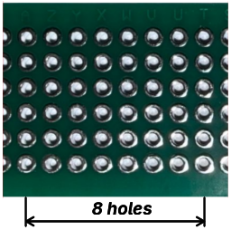
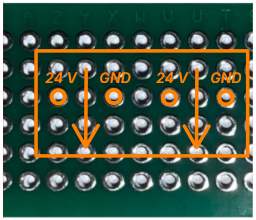
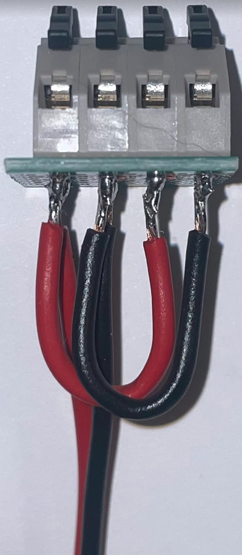
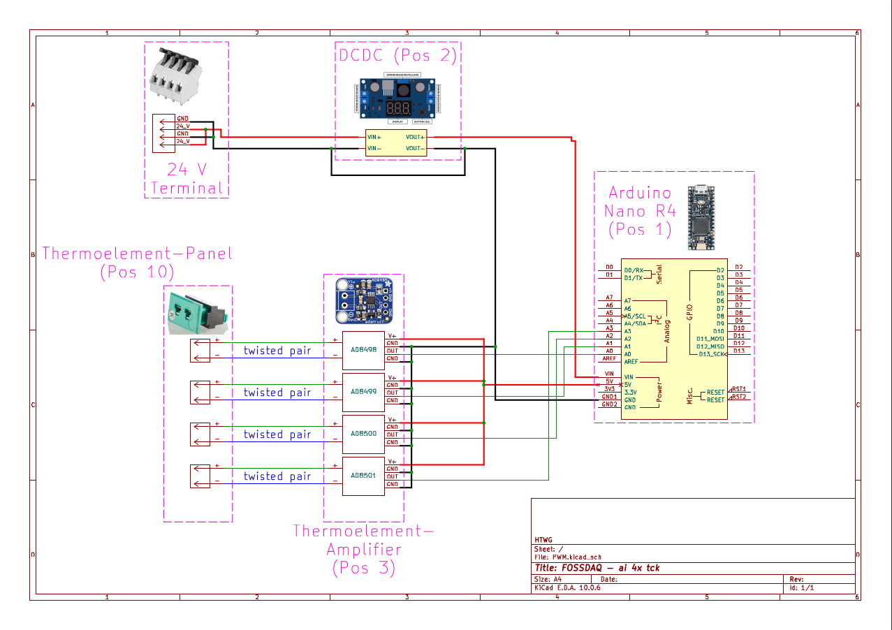

# ai-4x-tck

## 0 - 3D-printing
Youll need to print the following components: 

|image|Name and Link|
|---|---|
||[Case](../hardware/)|
||[Lid](../hardware/)|
||[Mounting Plate Arduino](../hardware/)|
||[slate pin](../hardware/)|

 ## 1 - 24 V Terminal Assembly

### Materials

<table>
  <tr>
    <td rowspan="1">Pos</td>
    <td rowspan="1">Part</td>
    <td colspan="6">number of parts</td>
  </tr>

  <tr>
    <td rowspan="1">4</td>
    <td rowspan="1"><a href="https://www.reichelt.de/de/de/shop/produkt/federkraftklemme_4-pol_0_08_-_1_mm_rm_5_0-72189">Spring-loaded terminal (4-pole)</td>
    <td colspan="6">1</td>
  </tr>
  <tr>
    <td rowspan="1">5</td>
    <td rowspan="1"><a href="https://www.reichelt.de/de/de/shop/produkt/lochrasterplatine_doppelseitig_80_x_20_mm-319114">perforated circuit board (2.54 mm; 80 x 20 mm)</td>
    <td colspan="6">1</td>
  </tr>
  <tr>
    <td rowspan="1">7.1</td>
    <td rowspan="1"><a href="https://www.reichelt.de/de/de/shop/produkt/kupferlitze_isoliert_10_m_4_x_0_50_mm_sw_gn_rt_bl-280308">red insulated copper stranded wire (≥ 0,5 mm²; ca. 20 cm each)</td>
    <td colspan="6">1</td>
  </tr>
  <tr>
    <td rowspan="1">7.2</td>
    <td rowspan="1"><a href="https://www.reichelt.de/de/de/shop/produkt/kupferlitze_isoliert_10_m_4_x_0_50_mm_sw_gn_rt_bl-280308">red insulated copper stranded wire (≥ 0,5 mm²; ca. 5 cm each)</td>
    <td colspan="6">1</td>
  </tr>
  <tr>
    <td rowspan="1">7.3</td>
    <td rowspan="1"><a href="https://www.reichelt.de/de/de/shop/produkt/kupferlitze_isoliert_10_m_4_x_0_50_mm_sw_gn_rt_bl-280308">black insulated copper stranded wire (≥ 0,5 mm²; ca. 20 cm each)</td>
    <td colspan="6">1</td>
  </tr>
  <tr>
    <td rowspan="1">7.4</td>
    <td rowspan="1"><a href="https://www.reichelt.de/de/de/shop/produkt/kupferlitze_isoliert_10_m_4_x_0_50_mm_sw_gn_rt_bl-280308">black insulated copper stranded wire (≥ 0,5 mm²; ca. 5 cm each)</td>
    <td colspan="6">1</td>
  </tr>
  </tr>
</table>

### Tools

- soldering iron with solder
- metal saw
- vise (recommended)
- small side-cutting pliers
- small metal file

### 1.1 - Step 1: Pre-assembling Spring-loaded terminal (4-pole)

|Pos in BOM|Part|Quantity||Tools|
|---|---|---|---|---|
|4|<a href="https://www.reichelt.de/de/de/shop/produkt/federkraftklemme_4-pol_0_08_-_1_mm_rm_5_0-72189">Spring-loaded terminal (4-pole)|1| |small metal file|
| | | | |vise (recommended)|

- The terminal pins are too large for the PCB holes.
- Carefully file down the edges of the pins until they fit into the holes of the perforated circuit board (80 x 20 mm) (BOM Pos 4).

### 1.2 - Step 2: cutting PCB to size

|Pos in BOM|Part|Quantity||Tools|
|---|---|---|---|---|
|5|<a href="https://www.reichelt.de/de/de/shop/produkt/lochrasterplatine_doppelseitig_80_x_20_mm-319114">perforated circuit board (80 x 20 mm)|1|      |metal saw|
| | | | |vise (recommended)|

- Take one perforated circuit board (80 x 20 mm) (BOM Pos 5)
- cut it to size using a metal saw.
    - measurements are written down below.
    - dont use much force at the end of the cut. Otherwise the Strip-Grid PCB will break.
      

This PCB will form now on be referenced as 24 V Terminal PCB.

### 1.3 - Step 3: soldering Spring-loaded terminal (4-pole)

|Pos in BOM|Part|Quantity||Tools|
|---|---|---|---|---|
|N/A|24 V Terminal PCB|1|      |soldering iron with solder|
|4|<a href="https://www.reichelt.de/de/de/shop/produkt/federkraftklemme_4-pol_0_08_-_1_mm_rm_5_0-72189">Spring-loaded terminal (4-pole)|1| ||

- Solder the 4-pole spring-loaded terminal (Pos 4) on the 24 V Terminal PCB as shown in the image below. 
  - Orange circles indicate the terminal pins.
  - The 4-pole spring-loaded terminal (Pos 4) is mounted on the side of the 24 V Terminal PCB facing towards you.
  - Arrows denote the direction of the spring loaded terminal ports.
      - The spring loaded terminal ports face down.

  

### 1.4 - Step 4: soldering insulated copper stranded wire to 24 V Terminal PCB

|Pos in BOM|Part|Quantity||Tools|
|---|---|---|---|---|
|N/A|24 V Terminal PCB|1|      |soldering iron with solder|
|7.1|<a href="https://www.reichelt.de/de/de/shop/produkt/kupferlitze_isoliert_10_m_4_x_0_50_mm_sw_gn_rt_bl-280308">red insulated copper stranded wire (≥ 0,5 mm²; ca. 20 cm each)|1| ||
|7.2|<a href="https://www.reichelt.de/de/de/shop/produkt/kupferlitze_isoliert_10_m_4_x_0_50_mm_sw_gn_rt_bl-280308">red insulated copper stranded wire (≥ 0,5 mm²; ca. 5 cm each)|1| ||
|7.3|<a href="https://www.reichelt.de/de/de/shop/produkt/kupferlitze_isoliert_10_m_4_x_0_50_mm_sw_gn_rt_bl-280308">black insulated copper stranded wire (≥ 0,5 mm²; ca. 20 cm each)|1| ||
|7.4|<a href="https://www.reichelt.de/de/de/shop/produkt/kupferlitze_isoliert_10_m_4_x_0_50_mm_sw_gn_rt_bl-280308">black insulated copper stranded wire (≥ 0,5 mm²; ca. 5 cm each)|1| ||

- Connect both 24 V pins with one red insulated copper stranded wire (≥ 0,5 mm²; ca. 5 cm each) (BOM Pos 7.2).
- Connect both GND pins with one black insulated copper stranded wire (≥ 0,5 mm²; ca. 5 cm each) (BOM Pos 7.4).
- Ensure no connection exists between any 24 V pin and any GND pin.
- Connect one red insulated copper stranded wire (≥ 0,5 mm²; ca. 20 cm each) (BOM Pos 7.1) to one 24 V pin.
- Connect one black insulated copper stranded wire (≥ 0,5 mm²; ca. 20 cm each) (BOM Pos 7.3) to one GND pin.
- Refer to the image below for clarity.

## 2 connecting all components

- Connect all assembled components as shown in the drawing above.
- Keep wires as short as possible to ensure they fit into the case.
