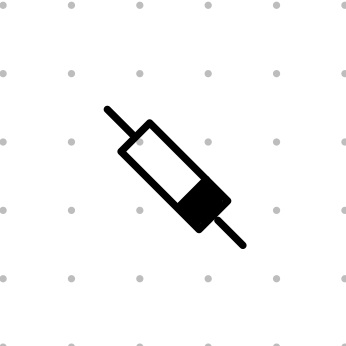

# ao-1to3x-0to10V

## 0 - 3D-printing
Youll need to print the following components: 

|image|Name and Link|
|---|---|
||[Case](../hardware)|
||[Lid](../hardware)|
||[Mounting Plate Arduino](../hardware)|
||[Mounting Plate PCB](../hardware)|

## 1 - PCB Assembly

### Materials
<table>
  <tr>
    <td rowspan="1">Pos in BOM</td>
    <td rowspan="1">Part</td>
    <td colspan="3">number of parts per number of outputs</td>
  </tr>
  <tr>
    <th></th><th></th><th>3x</th><th>2x</th><th>1x</th>
  </tr>
  <tr>
    <td>1</td><td><a href="https://www.reichelt.de/de/de/shop/produkt/hf-bipolartransistor_npn_100v_6a_65w_to-220-217329">transistor (MOSPEC - TIP41C)</a></td><td>3</td><td>2</td><td>1</td>
  </tr>
  <tr>
    <td>2</td><td><a href="https://www.reichelt.de/de/de/shop/produkt/schottkydiode_40_v_1_a_do-41-219559">diode (Taiwan Semiconductor - 1N5819)</a></td><td>3</td><td>2</td><td>1</td>
  </tr>
  <tr>
    <td>3</td><td><a href="https://www.reichelt.de/de/de/shop/produkt/widerstand_metallschicht_820_ohm_0207_0_6_w_1_-12002">resistor (820 Ohm)</a><td>3</td><td>2</td><td>1</td>
  </tr>
  <tr>
    <td>4</td><td><a href="https://www.reichelt.de/de/de/shop/produkt/widerstand_metallschicht_3_83_kohm_0207_0_6_w_1_-11704">resistor (3.83 kOhm)</a><td>3</td><td>2</td><td>1</td>
  </tr>
  <tr>
    <td>5</td><td><a href="https://www.reichelt.de/de/de/shop/produkt/widerstand_metallschicht_10_0_kohm_0207_0_6_w_1_-11449">resistor (10 kOhm)</a><td>7</td><td>6</td><td>5</td>
  </tr>
  <tr>
    <td>6</td><td><a href="https://www.reichelt.de/de/de/shop/produkt/tantal_bedrahtet_10_f_10v_125_c-393673">condensatore (tantnal 10 µF)</a><td>3</td><td>2</td><td>1</td>
  </tr>
  <tr>
    <td>7</td><td><a href="https://www.reichelt.de/de/de/shop/produkt/keramik-kondensator_500v_100p-9316">condensatore (ceramic 0.1 µF)</a><td>6</td><td>4</td><td>2</td>
  </tr>
  <tr>
    <td>8</td><td><a href="https://www.reichelt.de/de/de/shop/produkt/operationsverstaerker_1-fach_dip-8-21555">operation amplifyer (Texas Instruments - TL071CP)</a><td>3</td><td>2</td><td>1</td>
  </tr>
  <tr>
    <td>9</td><td><a href="https://www.reichelt.de/de/de/shop/produkt/d_a-wandler_12-bit_1-kanal_spi_u-referenz_dip-8-280824">digital to analog converter (Microchip Technology - MCP 4821)</a><td>3</td><td>2</td><td>1</td>
  </tr>
  <tr>
    <td>10</td><td><a href="https://www.reichelt.de/de/de/shop/produkt/stiftleiste_1_x_16_polig_gerade_rastermass_2_54_mm-404301">pin header (16x1; 2,54 mm)</td><td>3</td><td>3</td><td>2</td>
  </tr>
  <tr>
    <td>11</td><td><a href="https://www.reichelt.de/de/de/shop/produkt/ic-sockel_8-polig_doppelter_federkontakt-8230">IC-Socket (8 pols)</td><td>6</td><td>4</td><td>2</td>
  </tr>
  <tr>
    <td rowspan="1">12</td>
    <td rowspan="1"><a href="https://www.reichelt.de/de/de/shop/produkt/streifenrasterplatine_hartpapier_100x100mm-8277">Strip-Grid PCB (2.54 mm; 39 x 39 holes)</td>
    <td colspan="3">2</td>
  </tr>
  <tr>
    <td rowspan="1">15</td>
    <td rowspan="1"><a href="https://www.reichelt.de/de/de/shop/produkt/dc_dc-wandler_tmh_2_w_12_v_80_ma_sil-7-121355">DCDC converter 24 V to ±12 V (TRACO POWER TMH 2412D)</td>
    <td colspan="3">1</td>
  </tr>
  <tr>
    <td rowspan="1">19.1</td>
    <td rowspan="1"><a href="https://www.reichelt.de/de/de/shop/produkt/kupferlitze_isoliert_10_m_4_x_0_50_mm_sw_gn_rt_bl-280308">red insulated copper stranded wire (≥ 0,5 mm²; ca. 20 cm each)</td>
    <td colspan="3">3</td>
  </tr>
  <tr>
    <td rowspan="1">19.2</td>
    <td rowspan="1"><a href="https://www.reichelt.de/de/de/shop/produkt/kupferlitze_isoliert_10_m_4_x_0_50_mm_sw_gn_rt_bl-280308">black insulated copper stranded wire (≥ 0,5 mm²; ca. 20 cm each)</td>
    <td colspan="3">3</td>
  </tr>
  <tr>
    <td>19.3</td><td><a href="https://www.reichelt.de/de/de/shop/produkt/kupferlitze_isoliert_10_m_4_x_0_50_mm_sw_gn_rt_bl-280308">green insulated copper stranded wire (≥ 0,5 mm²; ca. 20 cm each)</a><td>7</td><td>6</td><td>5</td>
  </tr>
  <tr>
    <td>19.4</td><td><a href="https://www.reichelt.de/de/de/shop/produkt/kupferlitze_isoliert_10_m_4_x_0_50_mm_sw_gn_rt_bl-280308">blue insulated copper stranded wire (≥ 0,5 mm²; ca. 20 cm each)</a><td>3</td><td>2</td><td>1</td>
  </tr>
  </tr>
</table>

### Tools 

- soldering iron
- sharp knife
- metalsaw
- vise (recommended)
- small flathead screwdriver

### 1.1 - Step 1: cutting PCB to size

|Pos in BOM|Part|Quantity||Tools|
|---|---|---|---|---|
|12|[Strip-Grid PCB (2.54 mm; 39 x 39 holes)](https://www.reichelt.de/de/de/shop/produkt/streifenrasterplatine_hartpapier_100x100mm-8277)|2|      |metalsaw|
| | | | |vise (recommended)|

### 1.1 - Step 1: soldering 10 kOhm resisitors
**Materials for this step**
<table>
  <tr>
    <td rowspan="1">Pos in BOM</td>
    <td rowspan="1">Part</td>
    <td colspan="3">number of parts per number of outputs</td>
  </tr>
  <tr>
    <th></th><th></th><th>3x</th><th>2x</th><th>1x</th>
  </tr>
  <tr>
    <td>5</td><td><a href="https://www.reichelt.de/de/de/shop/produkt/widerstand_metallschicht_10_0_kohm_0207_0_6_w_1_-11449">resistor (10 kOhm)</a><td>7</td><td>6</td><td>5</td>
  </tr>
  </tr>
</table>
