# ao-1to3x-0to10V

## 0 - 3D-printing
Youll need to print the following components: 

|image|Name and Link|
|---|---|
||[Case](../hardware)|
||[Lid](../hardware)|
||[Mounting Plate Arduino](../hardware)|
||[Mounting Plate PCB](../hardware)|

## 1 - PCB Assembly

### Materials
<table>
  <tr>
    <td rowspan="1">Pos in BOM</td>
    <td rowspan="1">Part</td>
    <td colspan="3">number of parts per number of outputs</td>
  </tr>
  <tr>
    <th></th><th></th><th>3x</th><th>2x</th><th>1x</th>
  </tr>
  <tr>
    <td>1</td><td><a href="https://www.reichelt.de/de/de/shop/produkt/hf-bipolartransistor_npn_100v_6a_65w_to-220-217329">transistor (MOSPEC - TIP41C)</a></td><td>3</td><td>2</td><td>1</td>
  </tr>
  <tr>
    <td>2</td><td><a href="https://www.reichelt.de/de/de/shop/produkt/schottkydiode_40_v_1_a_do-41-219559">diode (Taiwan Semiconductor - 1N5819)</a></td><td>3</td><td>2</td><td>1</td>
  </tr>
  <tr>
    <td>3</td><td><a href="https://www.reichelt.de/de/de/shop/produkt/widerstand_metallschicht_820_ohm_0207_0_6_w_1_-12002">resistor (820 Ohm)</a><td>3</td><td>2</td><td>1</td>
  </tr>
  <tr>
    <td>4</td><td><a href="https://www.reichelt.de/de/de/shop/produkt/widerstand_metallschicht_3_83_kohm_0207_0_6_w_1_-11704">resistor (3.83 kOhm)</a><td>3</td><td>2</td><td>1</td>
  </tr>
  <tr>
    <td>5</td><td><a href="https://www.reichelt.de/de/de/shop/produkt/widerstand_metallschicht_10_0_kohm_0207_0_6_w_1_-11449">resistor (10 kOhm)</a><td>7</td><td>6</td><td>5</td>
  </tr>
  <tr>
    <td>6</td><td><a href="https://www.reichelt.de/de/de/shop/produkt/tantal_bedrahtet_10_f_10v_125_c-393673">condensatore (tantnal 10 µF)</a><td>3</td><td>2</td><td>1</td>
  </tr>
  <tr>
    <td>7</td><td><a href="https://www.reichelt.de/de/de/shop/produkt/keramik-kondensator_500v_100p-9316">condensatore (ceramic 0.1 µF)</a><td>6</td><td>4</td><td>2</td>
  </tr>
  <tr>
    <td>8</td><td><a href="https://www.reichelt.de/de/de/shop/produkt/operationsverstaerker_1-fach_dip-8-21555">operation amplifyer (Texas Instruments - TL071CP)</a><td>3</td><td>2</td><td>1</td>
  </tr>
  <tr>
    <td>9</td><td><a href="https://www.reichelt.de/de/de/shop/produkt/d_a-wandler_12-bit_1-kanal_spi_u-referenz_dip-8-280824">digital to analog converter (Microchip Technology - MCP 4821)</a><td>3</td><td>2</td><td>1</td>
  </tr>
  <tr>
    <td>10.1</td><td><a href="https://www.reichelt.de/de/de/shop/produkt/stiftleiste_1_x_16_polig_gerade_rastermass_2_54_mm-404301">single pin header (1x1; 2,54 mm)</td><td>40</td><td>31</td><td>24</td>
  </tr>
  <tr>
    <td>10.2</td><td><a href="https://www.reichelt.de/de/de/shop/produkt/stiftleiste_1_x_16_polig_gerade_rastermass_2_54_mm-404301">double pin header (2x1; 2,54 mm)</td><td>3</td><td>2</td><td>1</td>
  </tr>
  <tr>
    <td>11</td><td><a href="https://www.reichelt.de/de/de/shop/produkt/ic-sockel_8-polig_doppelter_federkontakt-8230">IC-Socket (8 pols)</td><td>6</td><td>4</td><td>2</td>
  </tr>
  <tr>
    <td rowspan="1">12</td>
    <td rowspan="1"><a href="https://www.reichelt.de/de/de/shop/produkt/streifenrasterplatine_hartpapier_100x100mm-8277">Strip-Grid PCB (2.54 mm; 39 x 39 holes)</td>
    <td colspan="3">2</td>
  </tr>
  <tr>
    <td rowspan="1">15</td>
    <td rowspan="1"><a href="https://www.reichelt.de/de/de/shop/produkt/dc_dc-wandler_tmh_2_w_12_v_80_ma_sil-7-121355">DCDC converter 24 V to ±12 V (TRACO POWER TMH 2412D)</td>
    <td colspan="3">1</td>
  </tr>
  <tr>
    <td rowspan="1">19.1</td>
    <td rowspan="1"><a href="https://www.reichelt.de/de/de/shop/produkt/kupferlitze_isoliert_10_m_4_x_0_50_mm_sw_gn_rt_bl-280308">red insulated copper stranded wire (≥ 0,5 mm²; ca. 20 cm each)</td>
    <td colspan="3">3</td>
  </tr>
  <tr>
    <td rowspan="1">19.2</td>
    <td rowspan="1"><a href="https://www.reichelt.de/de/de/shop/produkt/kupferlitze_isoliert_10_m_4_x_0_50_mm_sw_gn_rt_bl-280308">black insulated copper stranded wire (≥ 0,5 mm²; ca. 20 cm each)</td>
    <td colspan="3">3</td>
  </tr>
  <tr>
    <td>19.3</td><td><a href="https://www.reichelt.de/de/de/shop/produkt/kupferlitze_isoliert_10_m_4_x_0_50_mm_sw_gn_rt_bl-280308">green insulated copper stranded wire (≥ 0,5 mm²; ca. 20 cm each)</a><td>7</td><td>6</td><td>5</td>
  </tr>
  <tr>
    <td>19.4</td><td><a href="https://www.reichelt.de/de/de/shop/produkt/kupferlitze_isoliert_10_m_4_x_0_50_mm_sw_gn_rt_bl-280308">blue insulated copper stranded wire (≥ 0,5 mm²; ca. 20 cm each)</a><td>3</td><td>2</td><td>1</td>
  </tr>
  </tr>
</table>

### Tools 

- soldering iron with solder
- sharp knife
- metal saw
- vise (recommended)
- small flathead screwdriver
- small side-cutting pliers

### 1.1 - Step 1: cutting PCB to size

|Pos in BOM|Part|Quantity||Tools|
|---|---|---|---|---|
|12|[Strip-Grid PCB (2.54 mm; 39 x 39 holes)](https://www.reichelt.de/de/de/shop/produkt/streifenrasterplatine_hartpapier_100x100mm-8277)|2|      |metal saw|
| | | | |vise (recommended)|

- Take one Strip-Grid PCB (BOM Pos 12)
- cut it to size using a metal saw
    - measurements are written down below.
        - the copper side faces downward.
        - the pink arrow indicates the direction of the copper stripes.
    - dont use much force at the end of the cut. Otherwise the Strip-Grid PCB will break.

|index|measurement in number of holes|
|---|---|
|vertical|39|
|horizontal|26|

This PCB will form now on be referenced as PCB 1.

- Take one Strip-Grid PCB (BOM Pos 12)
- cut it into four pieces using a metal saw
    - measurements are written down below.
        - the copper side faces down.
        - the pink arrow indicates the direction of the copper stripes.
    - dont use much force at the end of the cut. Otherwise the Strip-Grid PCB will break.

 
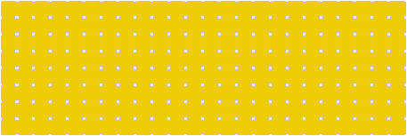

| |measurement in number of holes|
|---|---|
|vertical|7|
|horizontal|25|

This PCB will form now on be referenced as PCB 2.

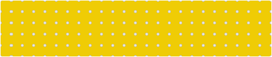

|index|measurement in number of holes|
|---|---|
|vertical|4|
|horizontal|25|

This PCB will form now on be referenced as PCB 3.

|index|measurement in number of holes|
|---|---|
|vertical|2|
|horizontal|25|

This PCB will form now on be referenced as PCB 4.

|index|measurement in number of holes|
|---|---|
|vertical|1|
|horizontal|25|

This PCB will form now on be referenced as PCB 5.

### 1.2 - Step 2: soldering 10 kOhm resisitors onto PCB 1

|Pos in BOM|Part|Quantity||Tools|
|---|---|---|---|---|
|N/A|PCB 1|1|      |soldering iron with solder|
|5|<a href="https://www.reichelt.de/de/de/shop/produkt/widerstand_metallschicht_10_0_kohm_0207_0_6_w_1_-11449">resistor (10 kOhm)|7| |small side-cutting pliers|

- mount the resistors (10 kOhm) (BOM Pos 5) on PCB 1 as shown below.
    - the copper side faces downward.
    - the pink arrow indicates the direction of the copper stripes.
- solder them in place using a soldering iron
- shorten the wire of the resistors using small side-cutting pliers

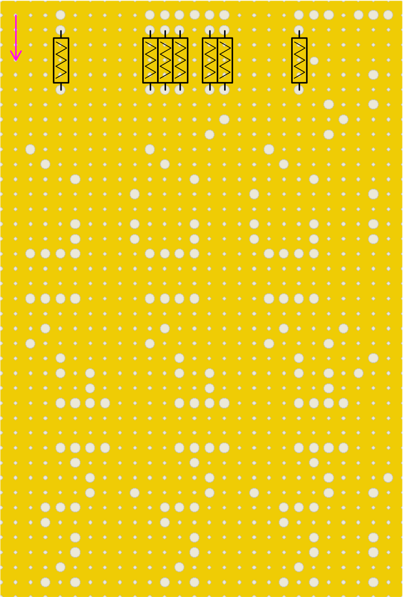

### 1.3 - Step 3: separating copper strips 

|Pos in BOM|Part|Quantity||Tools|
|---|---|---|---|---|
|N/A|PCB 1|1|      |sharp knife|

- separate the copper strips using a sharp knife as shown below. 
    - the red lines indicate, where the copper lines have to be separated. 
    - the copper side faces downward.
    - the pink arrow indicates the direction of the copper stripes.

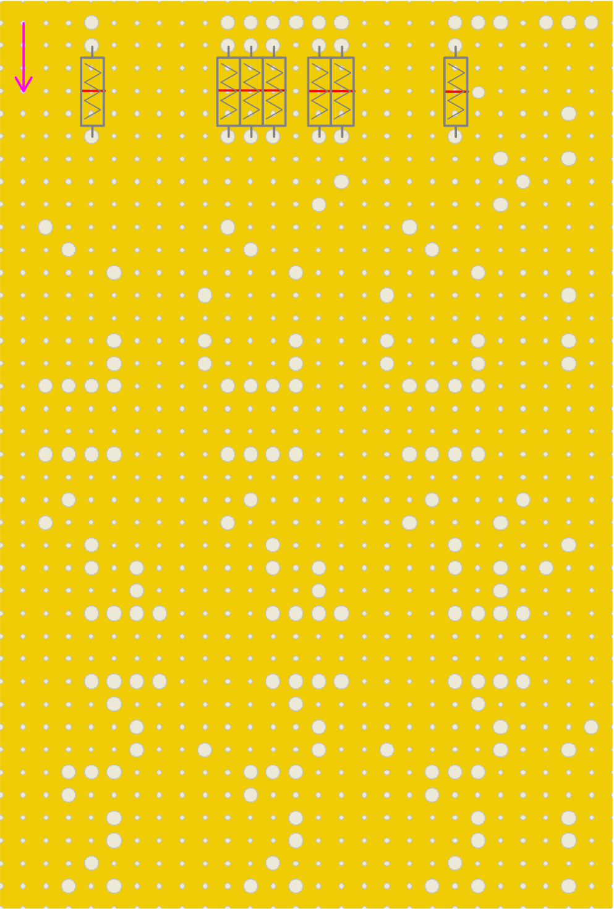

### 1.4 - Step 4: soldering 3.8 kOhm resistors onto PCB 1 

|Pos in BOM|Part|Quantity||Tools|
|---|---|---|---|---|
|N/A|PCB 1|1|      |soldering iron with solder|
|4|<a href="https://www.reichelt.de/de/de/shop/produkt/widerstand_metallschicht_3_83_kohm_0207_0_6_w_1_-11704">resistor (3.8 kOhm)|3| |small side-cutting pliers|

- mount the resistors (3.8 kOhm) (BOM Pos 4) on PCB 1 as shown below.
    - the copper side faces downward.
    - the pink arrow indicates the direction of the copper stripes.
    - make sure that the resistor and its wires lay on top of PCB 1 exactly as shown. 
- solder them in place using a soldering iron
- shorten the wire of the resistors using small side-cutting pliers

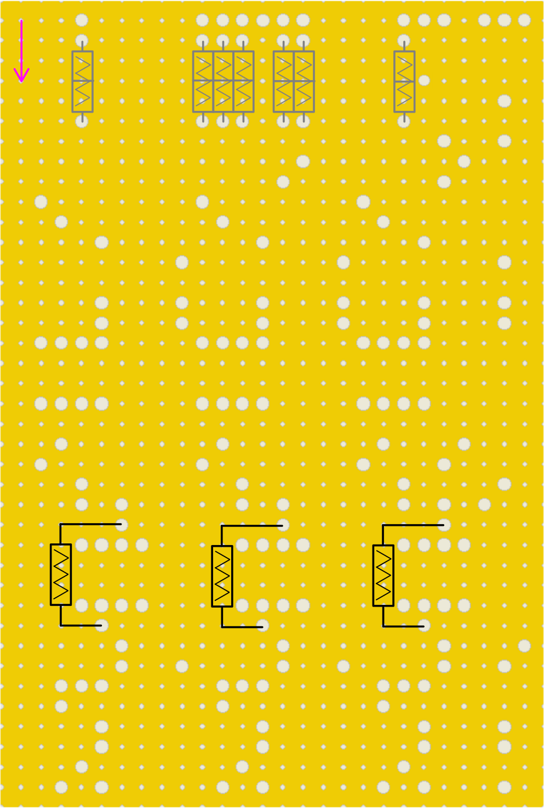

### 1.5 - Step 5: soldering 820 Ohm resistors onto PCB 1 

|Pos in BOM|Part|Quantity||Tools|
|---|---|---|---|---|
|N/A|PCB 1|1|      |soldering iron with solder|
|3|<a href="https://www.reichelt.de/de/de/shop/produkt/widerstand_metallschicht_820_ohm_0207_0_6_w_1_-12002">resistor (820 Ohm)|3| |small side-cutting pliers|

- mount the resistors (820 Ohm) (BOM Pos 3) on PCB 1 as shown below.
    - the copper side faces downward.
    - the pink arrow indicates the direction of the copper stripes.
    - make sure that the resistor and its wires lay on top of PCB 1 exactly as shown. 
- solder them in place using a soldering iron
- shorten the wire of the resistors using small side-cutting pliers

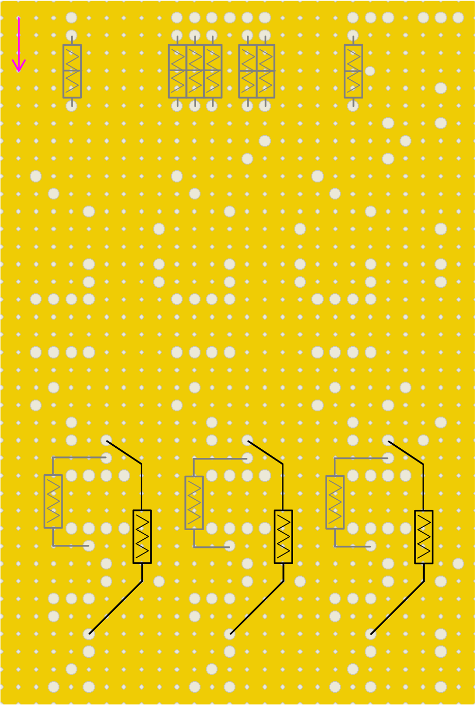

### 1.6 - Step 6: soldering diode onto PCB 1 

|Pos in BOM|Part|Quantity||Tools|
|---|---|---|---|---|
|N/A|PCB 1|1|      |soldering iron with solder|
|2|<a href="https://www.reichelt.de/de/de/shop/produkt/schottkydiode_40_v_1_a_do-41-219559">diode (Taiwan Semiconductor - 1N5819)</a>|3| |small side-cutting pliers|

- mount the diode (BOM Pos 2) on PCB 1 as shown below.
    - the copper side faces downward.
    - the pink arrow indicates the direction of the copper stripes.
    - make sure that the ring of the diode faces the same direction as shown.
- solder them in place using a soldering iron
- shorten the wire of the resistors using small side-cutting pliers

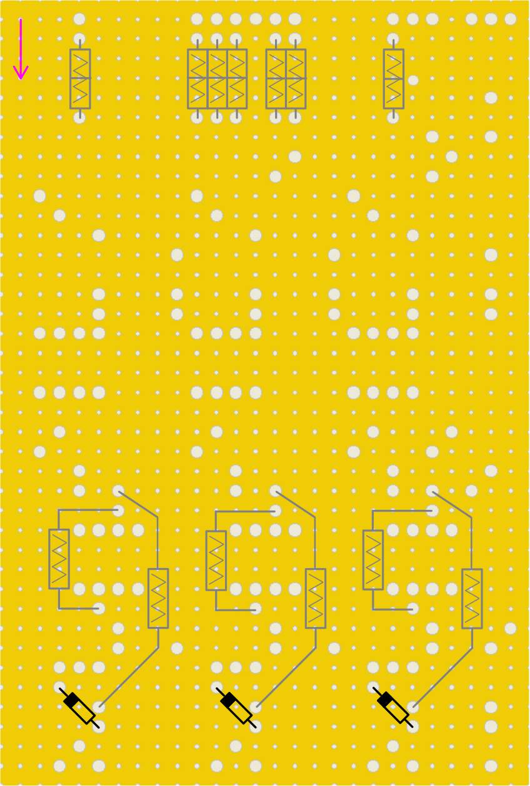

### 1.7 - Step 7: preparation for connection of PCB 1 and PCB 2 

|Pos in BOM|Part|Quantity||Tools|
|---|---|---|---|---|
|N/A|PCB 1|1|      ||
|10.1|<a href="https://www.reichelt.de/de/de/shop/produkt/stiftleiste_1_x_16_polig_gerade_rastermass_2_54_mm-404301">single pin header (1x1; 2,54 mm)</a>|18| ||

- Place the single pin headers (1x1; 2,54 mm) (BOM Pos 10.1) in the holes of PCB 1 as shown below.
    - the copper side faces downward.
    - the pink arrow indicates the direction of the copper stripes.
- do **not** solder them in at this time. 

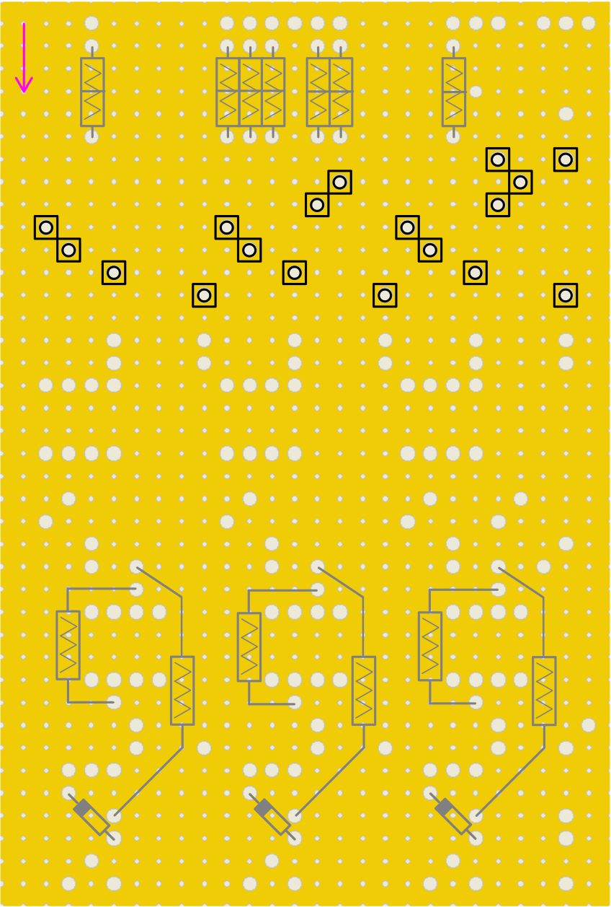

### 1.8 - Step 8: connecting PCB 1 and PCB 2 

|Pos in BOM|Part|Quantity||Tools|
|---|---|---|---|---|
|N/A|PCB 1|1|      |soldering iron with solder|
|N/A|PCB 2|1| ||

- Place PCB 2 on top of PCB 1 as shown below.
    - the copper side of PCB 1 faces downward.
    - the copper side of PCB 2 faces upward.
    - the pink arrow indicates the direction of the copper stripes of PCB 1.
    - make sure all pins pass through both PCBs 
- solder two pins to both PCBs to mechanically connect both PCBs.
    - these two pins should be as far away from each other as possible.
- solder the remaining pins.

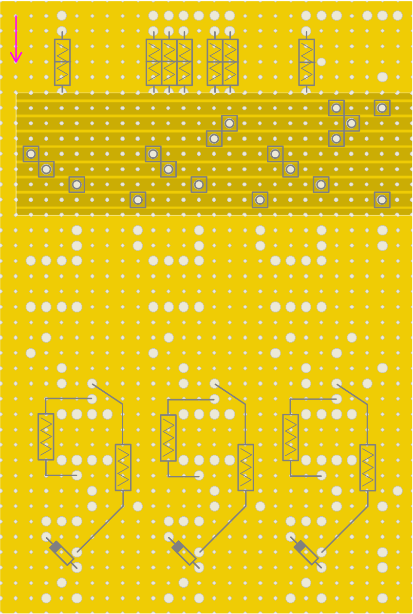

### 1.9 - Step 9: separating copper strips 

|Pos in BOM|Part|Quantity||Tools|
|---|---|---|---|---|
|N/A|PCB 1|1|      |sharp knife|

- separate the copper strips using a sharp knife as shown below. 
    - the red lines indicate, where the copper lines have to be separated. 
    - the copper side faces downward.
    - the pink arrow indicates the direction of the copper stripes.

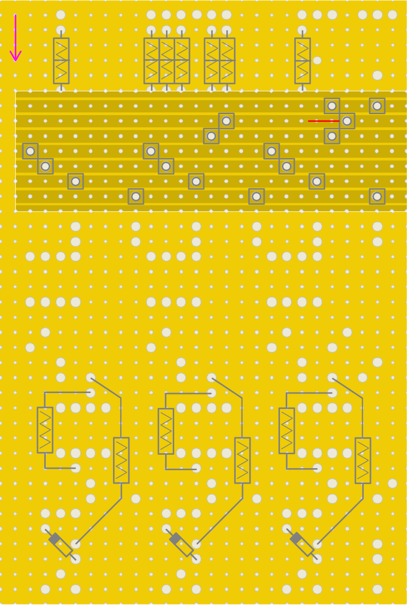

### 1.10 - Step 10: preparation for connection of PCB 1 and PCB 3 

|Pos in BOM|Part|Quantity||Tools|
|---|---|---|---|---|
|N/A|PCB 1|1|      ||
|10.1|<a href="https://www.reichelt.de/de/de/shop/produkt/stiftleiste_1_x_16_polig_gerade_rastermass_2_54_mm-404301">single pin header (1x1; 2,54 mm)</a>|10| ||
|10.2|<a href="https://www.reichelt.de/de/de/shop/produkt/stiftleiste_1_x_16_polig_gerade_rastermass_2_54_mm-404301">double pin header (2x1; 2,54 mm)</a>|3| ||

- Place the single pin headers (1x1; 2,54 mm) (BOM Pos 10.1) and double pin headers (2x1; 2,54 mm) (BOM Pos 10.2) in the holes of PCB 1 as shown below.
    - the copper side faces downward.
    - the pink arrow indicates the direction of the copper stripes.
- do **not** solder them in at this time. 

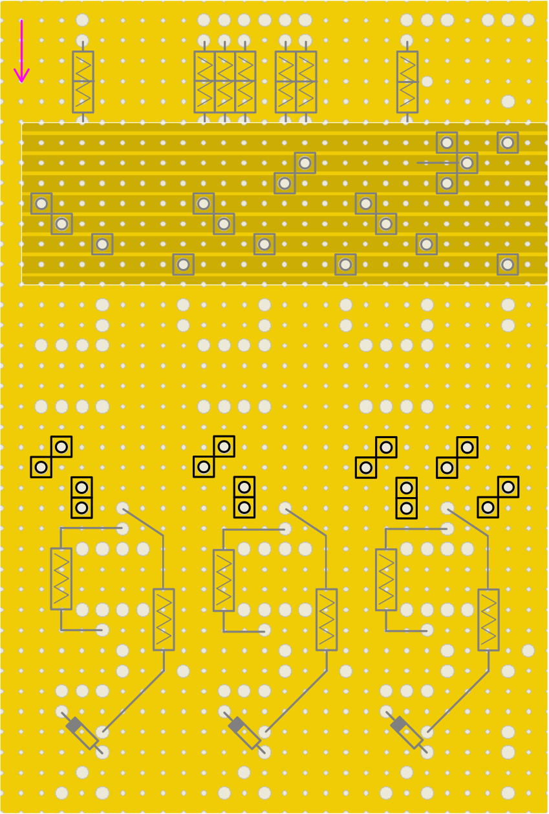

### 1.11 - Step 11: connecting PCB 1 and PCB 3 

|Pos in BOM|Part|Quantity||Tools|
|---|---|---|---|---|
|N/A|PCB 1|1|      |soldering iron with solder|
|N/A|PCB 3|1| ||

- Place PCB 3 on top of PCB 1 as shown below.
    - the copper side of PCB 1 faces downward.
    - the copper side of PCB 3 faces upward.
    - the pink arrow indicates the direction of the copper stripes of PCB 1.
    - make sure all pins pass through both PCBs 
- solder two pins to both PCBs to mechanically connect both PCBs.
    - these two pins should be as far away from each other as possible.
- solder the remaining pins.

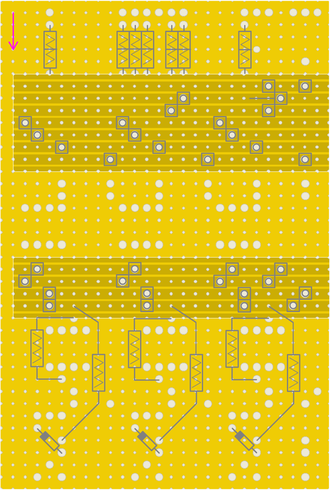

### 1.12 - Step 12: separating copper strips 

|Pos in BOM|Part|Quantity||Tools|
|---|---|---|---|---|
|N/A|PCB 1|1|      |sharp knife|

- separate the copper strips using a sharp knife as shown below. 
    - the red lines indicate, where the copper lines have to be separated. 
    - the copper side faces downward.
    - the pink arrow indicates the direction of the copper stripes.

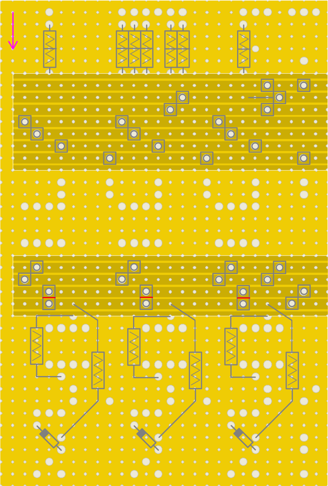

### 1.13 - Step 13: preparation for connection of PCB 1 and PCB 4 

|Pos in BOM|Part|Quantity||Tools|
|---|---|---|---|---|
|N/A|PCB 1|1|      ||
|10.1|<a href="https://www.reichelt.de/de/de/shop/produkt/stiftleiste_1_x_16_polig_gerade_rastermass_2_54_mm-404301">single pin header (1x1; 2,54 mm)</a>|4| ||

- Place the single pin headers (1x1; 2,54 mm) (BOM Pos 10.1) in the holes of PCB 1 as shown below.
    - the copper side faces downward.
    - the pink arrow indicates the direction of the copper stripes.
- do **not** solder them in at this time. 

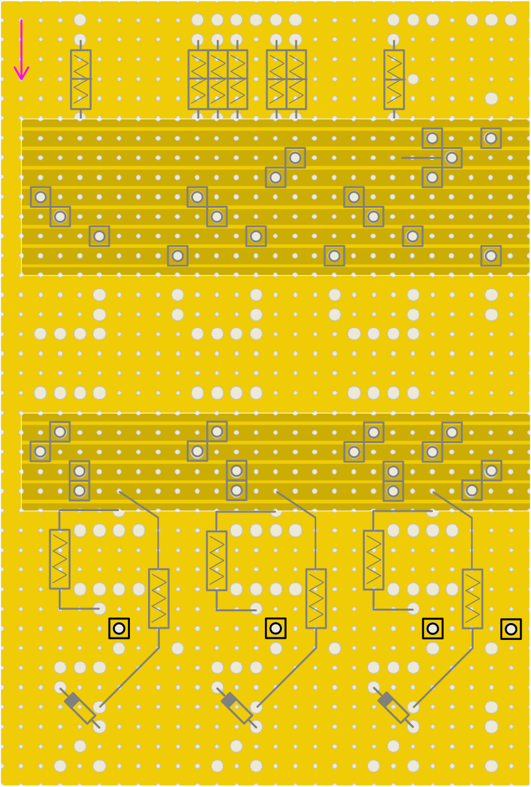

### 1.14 - Step 14: connecting PCB 1 and PCB 4 

|Pos in BOM|Part|Quantity||Tools|
|---|---|---|---|---|
|N/A|PCB 1|1|      |soldering iron with solder|
|N/A|PCB 4|1| ||

- Place PCB 4 on top of PCB 1 as shown below.
    - the copper side of PCB 1 faces downward.
    - the copper side of PCB 4 faces upward.
    - the pink arrow indicates the direction of the copper stripes of PCB 1.
    - make sure all pins pass through both PCBs 
- solder two pins to both PCBs to mechanically connect both PCBs.
    - these two pins should be as far away from each other as possible.
- solder the remaining pins.

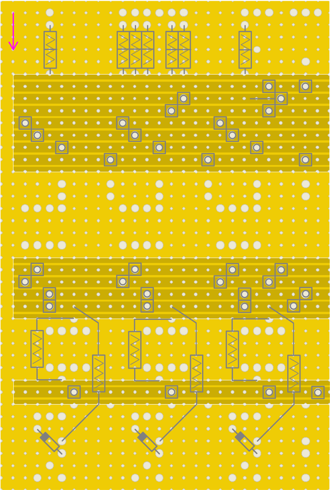

### 1.15 - Step 15: preparation for connection of PCB 1 and PCB 5

|Pos in BOM|Part|Quantity||Tools|
|---|---|---|---|---|
|N/A|PCB 1|1|      ||
|10.1|<a href="https://www.reichelt.de/de/de/shop/produkt/stiftleiste_1_x_16_polig_gerade_rastermass_2_54_mm-404301">single pin header (1x1; 2,54 mm)</a>|7| ||

- Place the single pin headers (1x1; 2,54 mm) (BOM Pos 10.1) in the holes of PCB 1 as shown below.
    - the copper side faces downward.
    - the pink arrow indicates the direction of the copper stripes.
- do **not** solder them in at this time. 

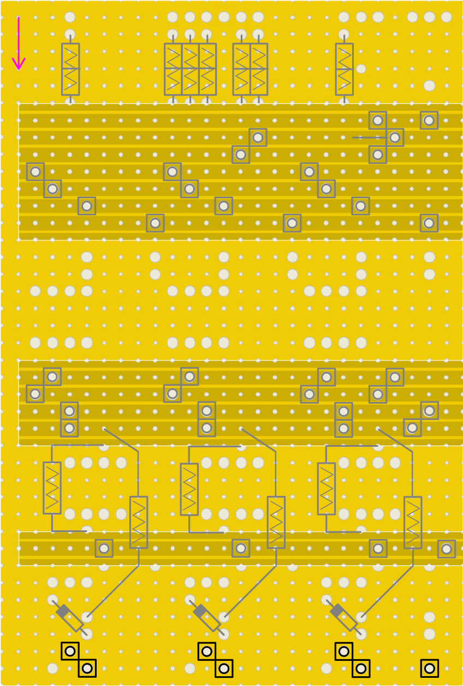

### 1.16 - Step 16: connecting PCB 1 and PCB 5

|Pos in BOM|Part|Quantity||Tools|
|---|---|---|---|---|
|N/A|PCB 1|1|      |soldering iron with solder|
|N/A|PCB 4|1| ||

- Place PCB 5 on top of PCB 1 as shown below.
    - the copper side of PCB 1 faces downward.
    - the copper side of PCB 5 faces upward.
    - the pink arrow indicates the direction of the copper stripes of PCB 1.
    - make sure all pins pass through both PCBs 
- solder two pins to both PCBs to mechanically connect both PCBs.
    - these two pins should be as far away from each other as possible.
- solder the remaining pins.

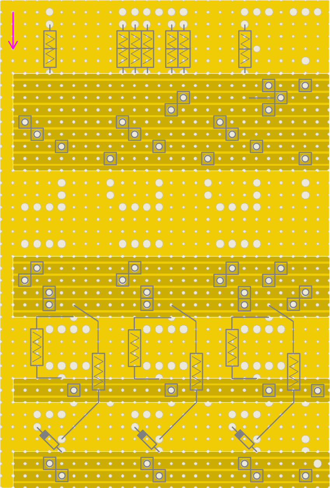

### 1.17 - Step 17: soldering DCDC converter 24 V to ±12 V

|Pos in BOM|Part|Quantity||Tools|
|---|---|---|---|---|
|N/A|PCB 1|1|      |soldering iron with solder|
|15|<a href="https://www.reichelt.de/de/de/shop/produkt/dc_dc-wandler_tmh_2_w_12_v_80_ma_sil-7-121355">DCDC converter 24 V to ±12 V (TRACO POWER TMH 2412D)|1| ||

- Solder the DCDC converter 24 V to ±12 V (TRACO POWER TMH 2412D) (BOM Pos 15) on top of PCB 1 as shown below.
    - the copper side of PCB 1 faces downward.
    - the pink arrow indicates the direction of the copper stripes of PCB 1.

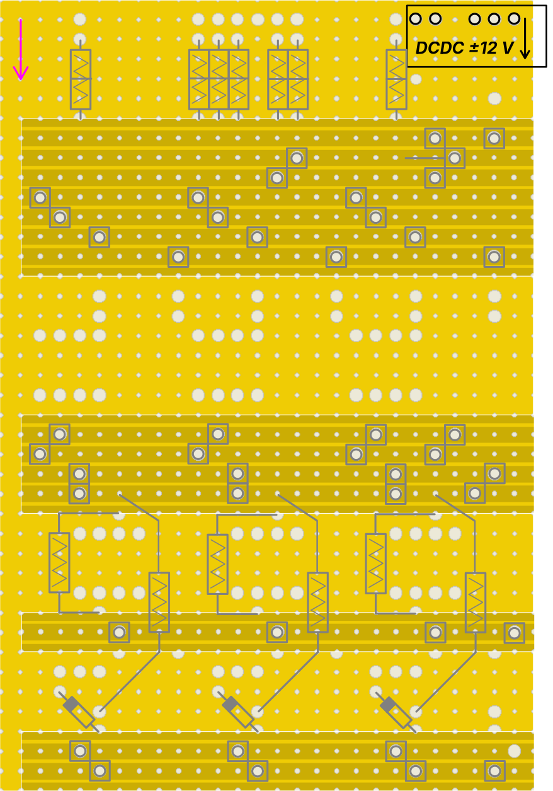

### 1.18 - Step 18: soldering operation amplifyer

|Pos in BOM|Part|Quantity||Tools|
|---|---|---|---|---|
|N/A|PCB 1|1|      |soldering iron with solder|
|11|<a href="https://www.reichelt.de/de/de/shop/produkt/ic-sockel_8-polig_doppelter_federkontakt-8230">IC-Socket (8 pols)|3| ||
|8|<a href="https://www.reichelt.de/de/de/shop/produkt/operationsverstaerker_1-fach_dip-8-21555">operation amplifyer (Texas Instruments - TL071CP)|3| ||

- Solder the IC-Socket (8 pols) (BOM Pos 11) on top of PCB 1 as shown below.
    - the copper side of PCB 1 faces downward.
    - the pink arrow indicates the direction of the copper stripes of PCB 1.
- Place the operation amplifyer (Texas Instruments - TL071CP) (BOM Pos 8) into the soldered IC-Socket (8 pols) (BOM Pos 11).
    - the notch must face in the same direction as shown below.

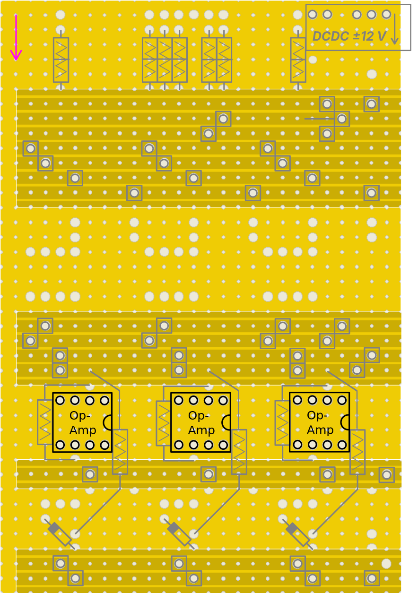

### 1.19 - Step 19: separating copper strips 

|Pos in BOM|Part|Quantity||Tools|
|---|---|---|---|---|
|N/A|PCB 1|1|      |sharp knife|

- separate the copper strips using a sharp knife as shown below. 
    - the red lines indicate, where the copper lines have to be separated. 
    - the copper side faces downward.
    - the pink arrow indicates the direction of the copper stripes.

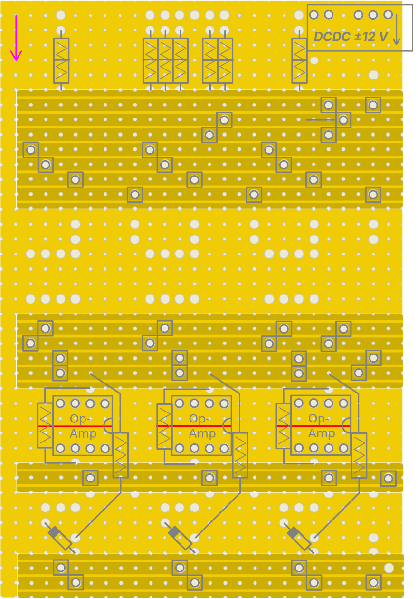

### 1.20 - Step 20: soldering digital to analog converter

|Pos in BOM|Part|Quantity||Tools|
|---|---|---|---|---|
|N/A|PCB 1|1|      |soldering iron with solder|
|11|<a href="https://www.reichelt.de/de/de/shop/produkt/ic-sockel_8-polig_doppelter_federkontakt-8230">IC-Socket (8 pols)|3| ||
|9|<a href="https://www.reichelt.de/de/de/shop/produkt/d_a-wandler_12-bit_1-kanal_spi_u-referenz_dip-8-280824">digital to analog converter (Microchip Technology - MCP 4821)</a>|3| ||

- Solder the IC-Socket (8 pols) (BOM Pos 11) on top of PCB 1 as shown below.
    - the copper side of PCB 1 faces downward.
    - the pink arrow indicates the direction of the copper stripes of PCB 1.
- Place the digital to analog converter (Microchip Technology - MCP 4821) (BOM Pos 9) into the soldered IC-Socket (8 pols) (BOM Pos 11).
    - the notch must face in the same direction as shown below.

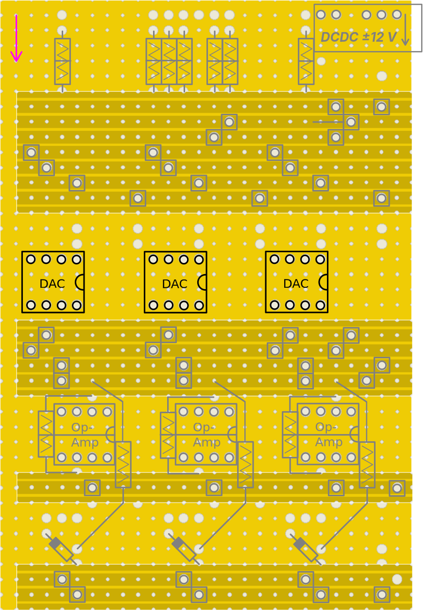

### 1.21 - Step 21: separating copper strips 

|Pos in BOM|Part|Quantity||Tools|
|---|---|---|---|---|
|N/A|PCB 1|1|      |sharp knife|

- separate the copper strips using a sharp knife as shown below. 
    - the red lines indicate, where the copper lines have to be separated. 
    - the copper side faces downward.
    - the pink arrow indicates the direction of the copper stripes.

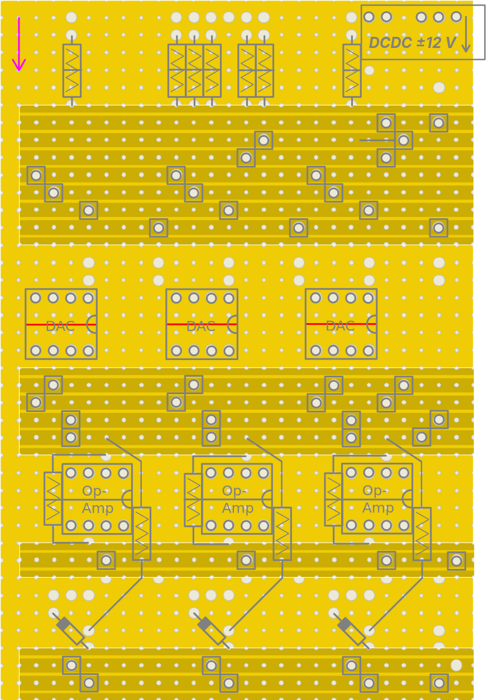

### 1.22 - Step 22: soldering condensatore (ceramic 0.1 µF)

|Pos in BOM|Part|Quantity||Tools|
|---|---|---|---|---|
|N/A|PCB 1|1|      |soldering iron with solder|
|7|<a href="https://www.reichelt.de/de/de/shop/produkt/keramik-kondensator_500v_100p-9316">condensatore (ceramic 0.1 µF)|6| ||

- Solder the condensatore (ceramic 0.1 µF) (BOM Pos 7) on top of PCB 1 as shown below.
    - the copper side of PCB 1 faces downward.
    - the pink arrow indicates the direction of the copper stripes of PCB 1.
    - the condensator is located above the wire of the resistor. The wires of both components must noch touch.

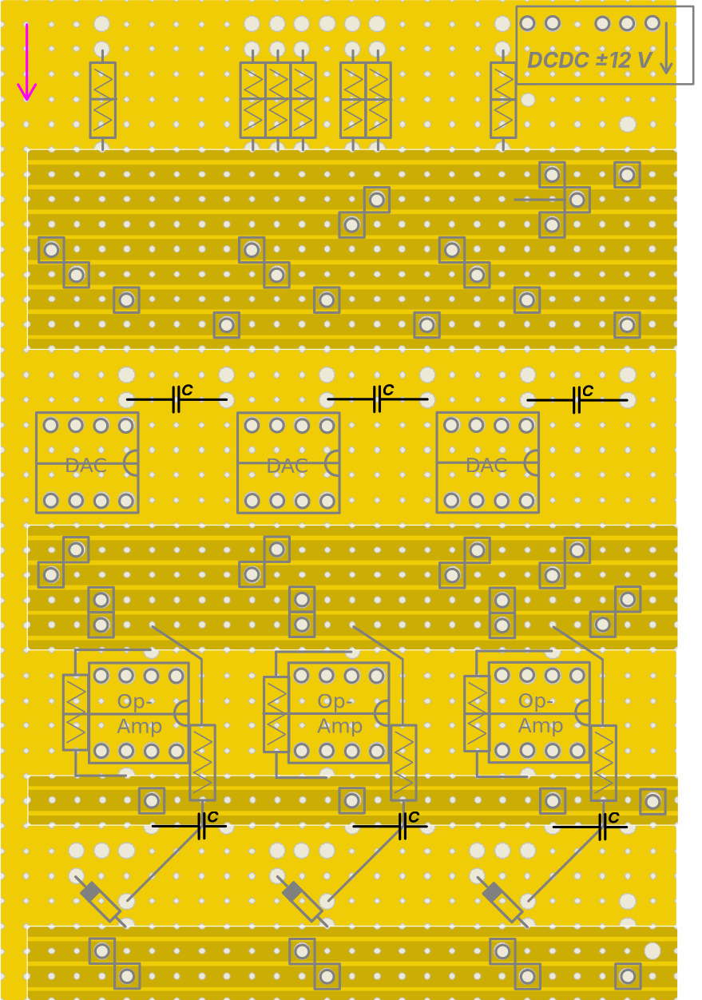

### 1.23 - Step 23: soldering condensatore (tantnal 10 µF)

|Pos in BOM|Part|Quantity||Tools|
|---|---|---|---|---|
|N/A|PCB 1|1|      |soldering iron with solder|
|6|<a href="https://www.reichelt.de/de/de/shop/produkt/tantal_bedrahtet_10_f_10v_125_c-393673">condensatore (tantnal 10 µF)</a>|3| ||

- Solder the condensatore (ceramic 0.1 µF) (BOM Pos 7) on top of PCB 1 as shown below.
    - the copper side of PCB 1 faces downward.
    - the pink arrow indicates the direction of the copper stripes of PCB 1.

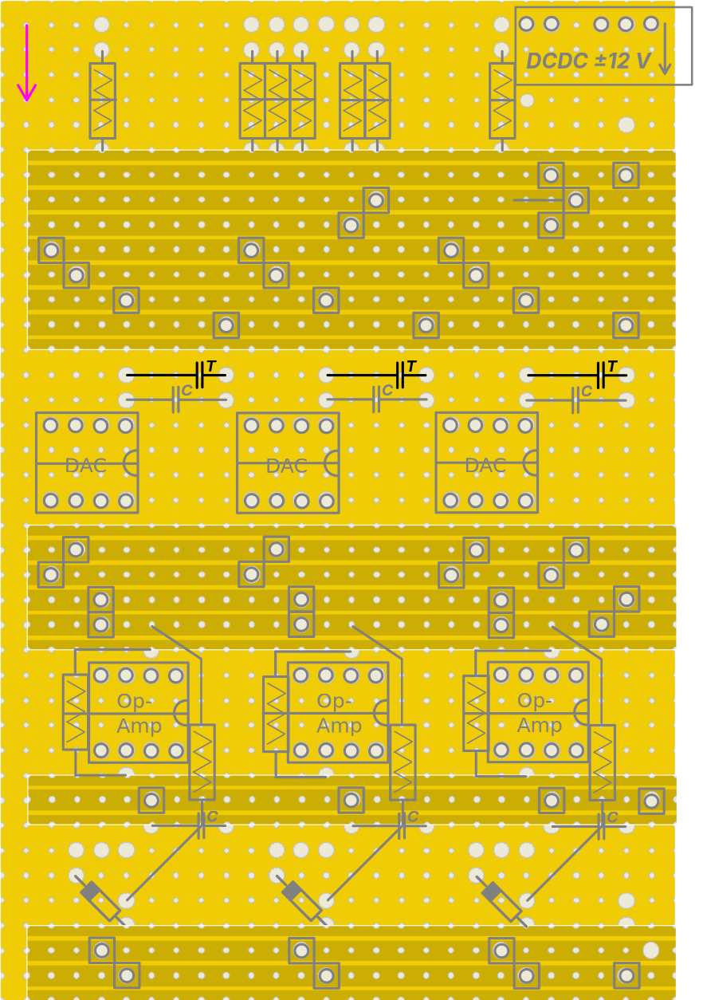

### 1.24 - Step 24: separating copper strips 

|Pos in BOM|Part|Quantity||Tools|
|---|---|---|---|---|
|N/A|PCB 1|1|      |sharp knife|

- separate the copper strips using a sharp knife as shown below. 
    - the red lines indicate, where the copper lines have to be separated. 
    - the copper side faces downward.
    - the pink arrow indicates the direction of the copper stripes.

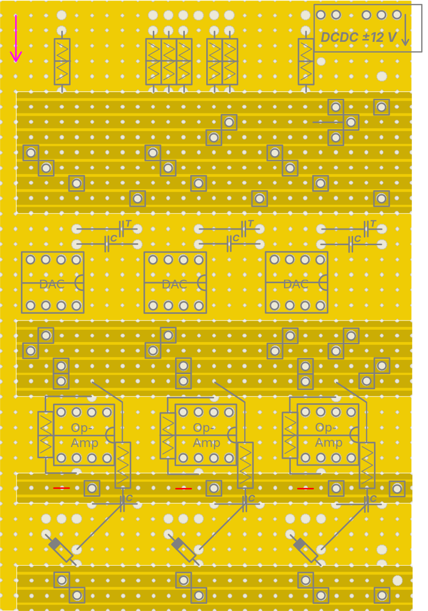

### 1.25 - Step 25: soldering transistor (MOSPEC - TIP41C)

|Pos in BOM|Part|Quantity||Tools|
|---|---|---|---|---|
|N/A|PCB 1|1|      |soldering iron with solder|
|1|<a href="https://www.reichelt.de/de/de/shop/produkt/hf-bipolartransistor_npn_100v_6a_65w_to-220-217329">transistor (MOSPEC - TIP41C)</a>|3| ||

- Solder the transistor (MOSPEC - TIP41C) (BOM Pos 1) on top of PCB 1 as shown below.
    - the copper side of PCB 1 faces downward.
    - the pink arrow indicates the direction of the copper stripes of PCB 1.
    - the transistor must face with its printed side in the direction of the black arrows.

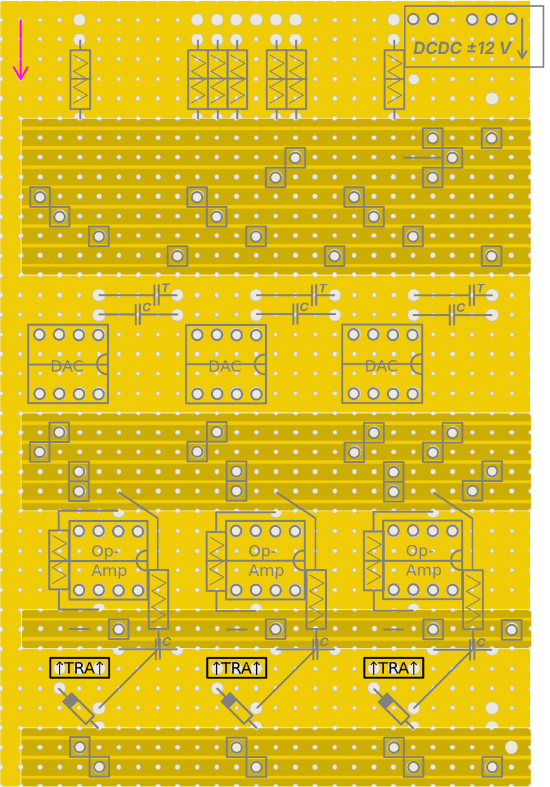

### 1.26 - Step 26: separating copper strips 

|Pos in BOM|Part|Quantity||Tools|
|---|---|---|---|---|
|N/A|PCB 1|1|      |sharp knife|

- separate the copper strips using a sharp knife as shown below. 
    - the red lines indicate, where the copper lines have to be separated. 
    - the copper side faces downward.
    - the pink arrow indicates the direction of the copper stripes.

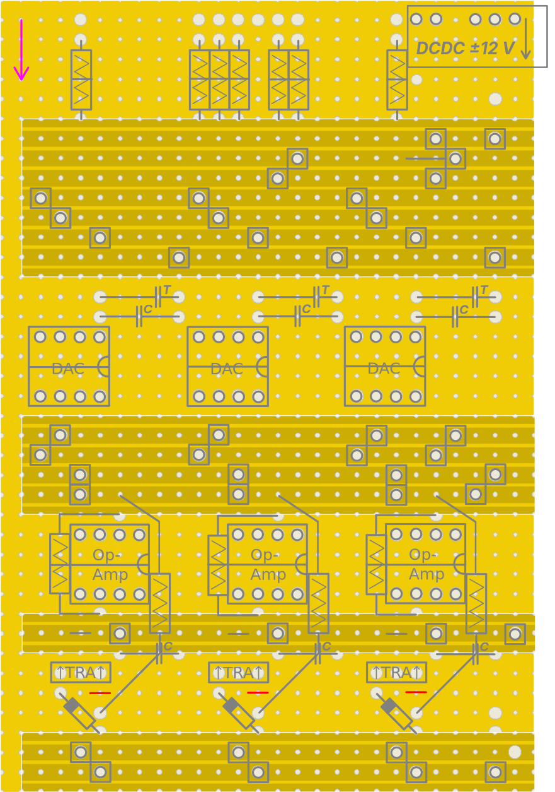

### 1.27 - Step 27: soldering cables

|Pos in BOM|Part|Quantity||Tools|
|---|---|---|---|---|
|N/A|PCB 1|1|      |soldering iron with solder|
|19.1|<a href="https://www.reichelt.de/de/de/shop/produkt/kupferlitze_isoliert_10_m_4_x_0_50_mm_sw_gn_rt_bl-280308">red insulated copper stranded wire (≥ 0,5 mm²; ca. 20 cm each)|3| ||
|19.2|<a href="https://www.reichelt.de/de/de/shop/produkt/kupferlitze_isoliert_10_m_4_x_0_50_mm_sw_gn_rt_bl-280308">black insulated copper stranded wire (≥ 0,5 mm²; ca. 20 cm each)|3| ||
|19.3|<a href="https://www.reichelt.de/de/de/shop/produkt/kupferlitze_isoliert_10_m_4_x_0_50_mm_sw_gn_rt_bl-280308">green insulated copper stranded wire (≥ 0,5 mm²; ca. 20 cm each)|7| ||
|19.4|<a href="https://www.reichelt.de/de/de/shop/produkt/kupferlitze_isoliert_10_m_4_x_0_50_mm_sw_gn_rt_bl-280308">blue insulated copper stranded wire (≥ 0,5 mm²; ca. 20 cm each)|3| ||

- Solder the insulated copper stranded wire (≥ 0,5 mm²; ca. 20 cm each) (BOM Pos 19) to PCB 1 as shown below.
    - the copper side of PCB 1 faces downward.
    - the pink arrow indicates the direction of the copper stripes of PCB 1.
    - the wire colour should match the one shown below.

|image|meaning|
|---|---|
||wire exits PCB 1 on the side of PCB 1s copper strips|
|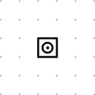|wire exits PCB 1 on the side with no copper strips|

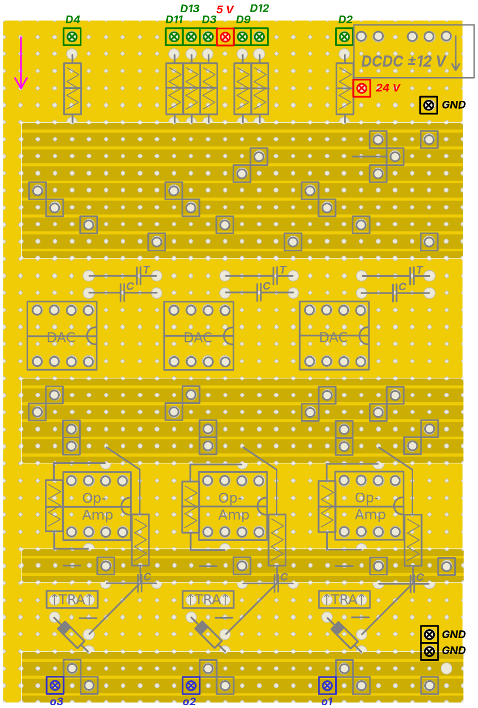

### 1.28 - Step 28: soldering cables

|Pos in BOM|Part|Quantity||Tools|
|---|---|---|---|---|
|N/A|PCB 1|1|      |soldering iron with solder|
|19.1|<a href="https://www.reichelt.de/de/de/shop/produkt/kupferlitze_isoliert_10_m_4_x_0_50_mm_sw_gn_rt_bl-280308">red insulated copper stranded wire (≥ 0,5 mm²; ca. 20 cm each)|3| ||

- Solder the red insulated copper stranded wire (≥ 0,5 mm²; ca. 20 cm each) (BOM Pos 19) to **PCB 5** as shown below.
    - the copper side of PCB 1 faces downward.
    - the pink arrow indicates the direction of the copper stripes of PCB 1.

|image|meaning|
|---|---|
||wire exits PCB 1 on the side with no copper strips|

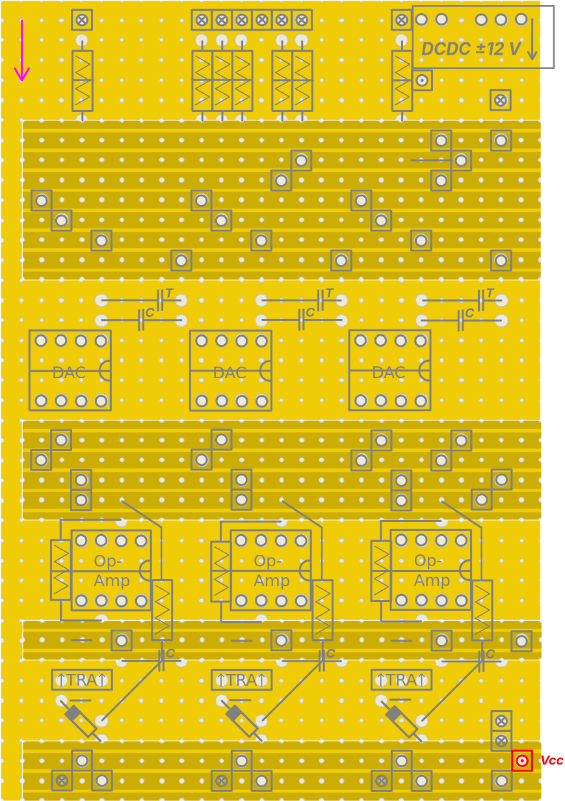
