# do-6x-PWM

## 0 - 3D-printing
You'll need to print the following components: 

|image|Name and Link|
|---|---|
|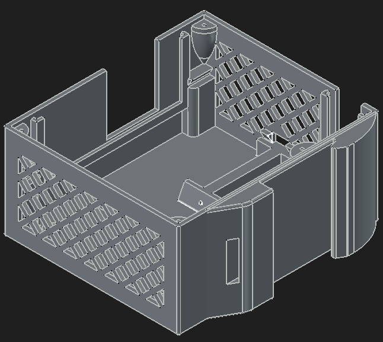|[Case](../hardware/PWM_Case.stl)|
|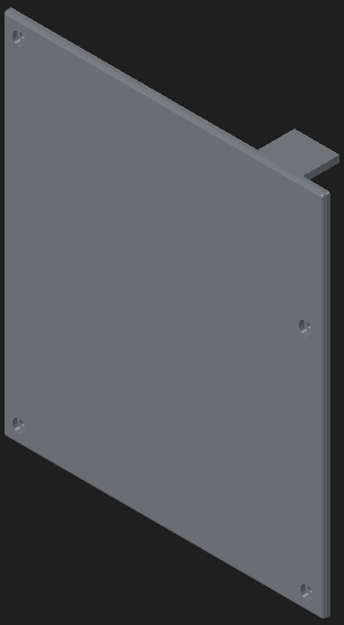|[Lid](../hardware/PWM_Lid.stl)|
|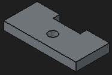|[Mounting Plate Arduino](../hardware/Arduino_Clip.stl)|
|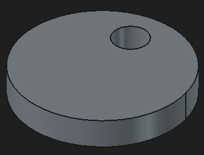|[Mounting Plate PCB](../hardware/PCB_Clip.stl)|
|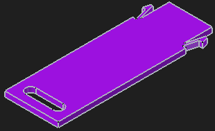|[slate pin](../hardware/slate_pin.stl)|

## 1 - PCB Assembly

### Materials 

<table>
  <tr>
    <td rowspan="1">Pos</td>
    <td rowspan="1">Part</td>
    <td colspan="1">number of parts</td>
  </tr>
  <tr>
    <td>1</td><td><a href="https://www.reichelt.de/de/de/shop/produkt/mosfet_n-ch_55v_47a_110w_to-220ab-129819">mosfet (Infineon - IRLZ44NPBF)</a></td><td>6</td>
  </tr>
  <tr>
    <td>2</td><td><a href="https://www.reichelt.de/de/de/shop/produkt/hf-bipolartransistor_npn_100v_6a_65w_to-220-217329">transistor (MOSPEC - TIP41C)</a></td><td>6</td>
  </tr>
  <tr>
    <td>3</td><td><a href="https://www.reichelt.de/de/de/shop/produkt/schottkydiode_40_v_1_a_do-41-219559">diode (Taiwan Semiconductor - 1N5819)</a></td><td>6</td>
  </tr>
  <tr>
    <td>4</td><td><a href="https://www.reichelt.de/de/de/shop/produkt/widerstand_metallschicht_10_0_kohm_0207_0_6_w_1_-11449">resistor (10 kOhm)</a></td><td>12</td>
  </tr>
  <tr>
    <td rowspan="1">5</td>
    <td rowspan="1"><a href="https://www.reichelt.de/de/de/shop/produkt/streifenrasterplatine_hartpapier_100x100mm-8277">Strip-Grid PCB (39 x 39 holes)</td>
    <td colspan="6">2</td>
  </tr>
  <tr>
    <td rowspan="1">8</td>
    <td rowspan="1"><a href="https://www.reichelt.de/de/de/shop/produkt/hex-schmitt-trigger-inverter_2_6_v_dil-14-290494">Hex-Schmitt-Trigger-Inverter (Texas Instruments - 74HC 14 TI)</td>
    <td colspan="6">1</td>
  </tr>
  <tr>
    <td rowspan="1">9</td>
    <td rowspan="1"><a href="https://www.reichelt.de/de/de/shop/produkt/ic-sockel_14-polig_doppelter_federkontakt-8206">IC-Socket (DIL-14)</td>
    <td colspan="6">1</td>
  </tr>
  <tr>
    <td rowspan="1">12.1</td>
    <td rowspan="1"><a href="https://www.reichelt.de/de/de/shop/produkt/stiftleiste_1_x_16_polig_gerade_rastermass_2_54_mm-404301">single pin header (1x1; 2,54 mm)</td>
    <td colspan="6">26</td>
  </tr>
  <tr>
    <td rowspan="1">15.1</td>
    <td rowspan="1"><a href="https://www.reichelt.de/de/de/shop/produkt/kupferlitze_isoliert_10_m_4_x_0_50_mm_sw_gn_rt_bl-280308">red insulated copper stranded wire (≥ 0,5 mm²; ca. 10 cm each)</td>
    <td colspan="6">2</td>
  </tr>
  <tr>
    <td rowspan="1">15.2</td>
    <td rowspan="1"><a href="https://www.reichelt.de/de/de/shop/produkt/kupferlitze_isoliert_10_m_4_x_0_50_mm_sw_gn_rt_bl-280308">black insulated copper stranded wire (≥ 0,5 mm²; ca. 10 cm each)</td>
    <td colspan="6">1</td>
  </tr>
  <tr>
    <td rowspan="1">15.3</td>
    <td rowspan="1"><a href="https://www.reichelt.de/de/de/shop/produkt/kupferlitze_isoliert_10_m_4_x_0_50_mm_sw_gn_rt_bl-280308">green insulated copper stranded wire (≥ 0,5 mm²; ca. 10 cm each)</td>
    <td colspan="6">12</td>
  </tr>
  <tr>
    <td rowspan="1">15.4</td>
    <td rowspan="1"><a href="https://www.reichelt.de/de/de/shop/produkt/kupferlitze_isoliert_10_m_4_x_0_50_mm_sw_gn_rt_bl-280308">blue insulated copper stranded wire (≥ 0,5 mm²; ca. 10 cm each)</td>
    <td colspan="6">6</td>
  </tr>
  </tr>
</table>

### Tools 

- soldering iron with solder
- sharp knife
- metal saw
- vise (recommended)
- small side-cutting pliers
- small needle-nose pliers

### 1.1 - Step 1: cutting PCB to size

|Pos in BOM|Part|Quantity||Tools|
|---|---|---|---|---|
|5|[Strip-Grid PCB (2.54 mm; 39 x 39 holes)](https://www.reichelt.de/de/de/shop/produkt/streifenrasterplatine_hartpapier_100x100mm-8277)|2|      |metal saw|
| | | | |vise (recommended)|

- Take one Strip-Grid PCB (BOM Pos 5)
- cut it to size using a metal saw
    - measurements are written down below.
        - the copper side faces downward.
        - the pink arrow indicates the direction of the copper stripes.
    - dont use much force at the end of the cut. Otherwise the Strip-Grid PCB will break.

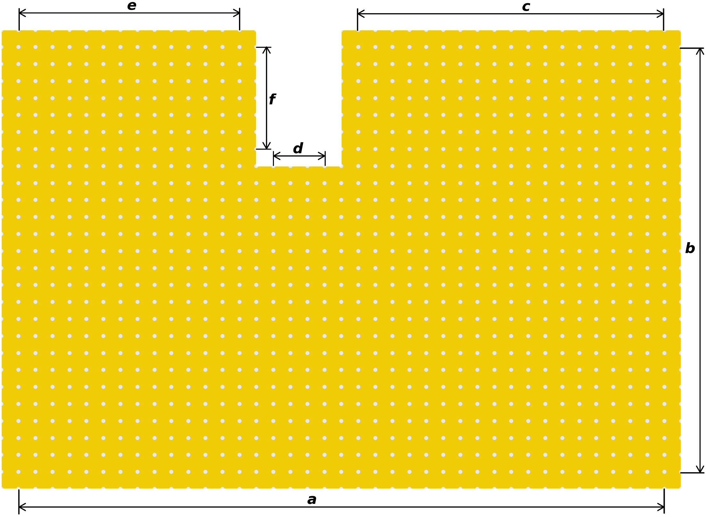

|index|measurement|
|---|---|
|a|39 holes|
|b|26 holes|
|c|19 holes|
|d|4 holes|
|e|14 holes|
|f|7 holes|

This PCB will form now on be referenced as PCB 1.

- Take one Strip-Grid PCB (BOM Pos 5)
- cut it into four pieces using a metal saw
    - measurements are written down below.
        - the copper side faces down.
        - the pink arrow indicates the direction of the copper stripes.
    - dont use much force at the end of the cut. Otherwise the Strip-Grid PCB will break.

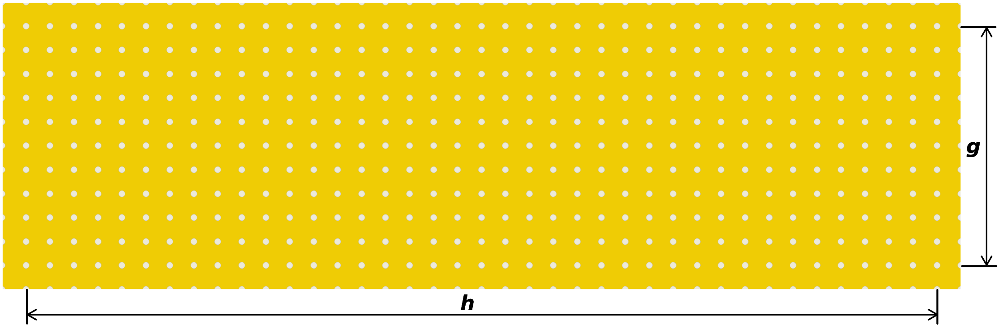

|index|measurement|
|---|---|
|g|11 holes|
|h|39 holes|

This PCB will form now on be referenced as PCB 2.

### 1.2 - Step 2: preparation for connection of PCB 1 and PCB 2 

|Pos in BOM|Part|Quantity||Tools|
|---|---|---|---|---|
|N/A|PCB 1|1|      ||
|12.1|<a href="https://www.reichelt.de/de/de/shop/produkt/stiftleiste_1_x_16_polig_gerade_rastermass_2_54_mm-404301">single pin header (1x1; 2,54 mm)</a>|26| ||

- Place the single pin headers (1x1; 2,54 mm) (BOM Pos 12.1) in the holes of PCB 1 as shown below.
    - the copper side faces downward.
    - the pink arrow indicates the direction of the copper stripes.
- do **not** solder them in at this time. 

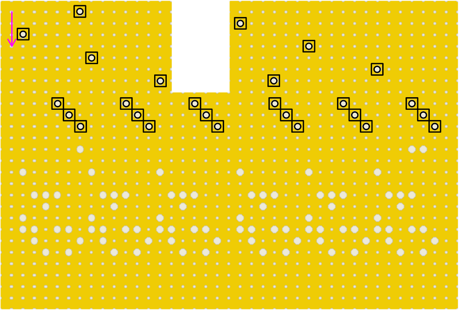

### 1.3 - Step 3: connecting PCB 1 and PCB 2 

|Pos in BOM|Part|Quantity||Tools|
|---|---|---|---|---|
|N/A|PCB 1|1|      |soldering iron with solder|
|N/A|PCB 2|1| ||

- Place PCB 2 on top of PCB 1 as shown below.
    - the copper side of PCB 1 faces downward.
    - the copper side of PCB 2 faces upward.
    - the pink arrow indicates the direction of the copper stripes of PCB 1.
    - make sure all pins pass through both PCBs 
- solder two pins to both PCBs to mechanically connect both PCBs.
    - these two pins should be as far away from each other as possible.
- solder the remaining pins.

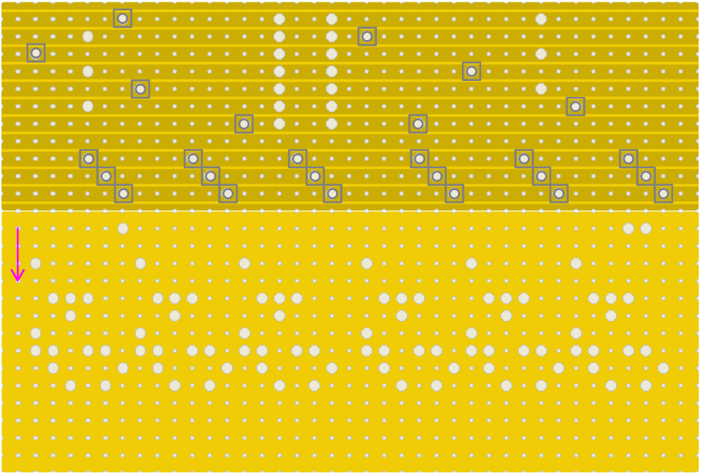

### 1.4 - Step 4: soldering 10 kOhm resistors onto PCB 1

|Pos in BOM|Part|Quantity||Tools|
|---|---|---|---|---|
|N/A|PCB 1|1|      |soldering iron with solder|
|4|<a href="https://www.reichelt.de/de/de/shop/produkt/widerstand_metallschicht_10_0_kohm_0207_0_6_w_1_-11449">resistor (10 kOhm)|12| |small side-cutting pliers|

- mount the resistors (10 kOhm) (BOM Pos 4) on PCB 1 as shown below.
    - the copper side faces downward.
    - the pink arrow indicates the direction of the copper stripes.
- solder them in place using a soldering iron
- shorten the wire of the resistors using small side-cutting pliers

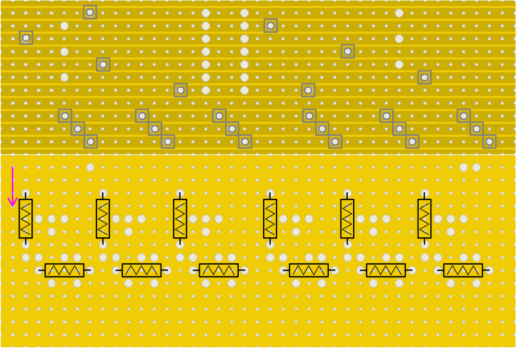

### 1.5 - Step 5: separating copper strips 

|Pos in BOM|Part|Quantity||Tools|
|---|---|---|---|---|
|N/A|PCB 1|1|      |sharp knife|

- separate the copper strips using a sharp knife as shown below. 
    - the red lines indicate, where the copper lines have to be separated. 
    - the copper side faces downward.
    - the pink arrow indicates the direction of the copper stripes.

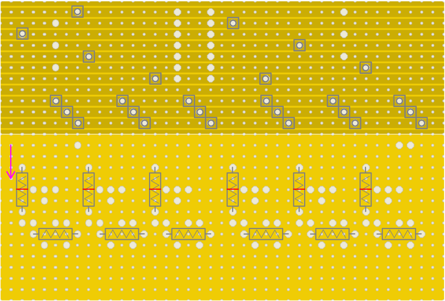

### 1.6 - Step 6: soldering diode onto PCB 1 

|Pos in BOM|Part|Quantity||Tools|
|---|---|---|---|---|
|N/A|PCB 1|1|      |soldering iron with solder|
|3|<a href="https://www.reichelt.de/de/de/shop/produkt/schottkydiode_40_v_1_a_do-41-219559">diode (Taiwan Semiconductor - 1N5819)</a>|6| |small side-cutting pliers|

- mount the diode (BOM Pos 3) on PCB 1 as shown below.
    - the copper side faces downward.
    - the pink arrow indicates the direction of the copper stripes.
    - make sure that the ring of the diode faces the same direction as shown.
- solder them in place using a soldering iron
- shorten the wires of the diodes using small side-cutting pliers

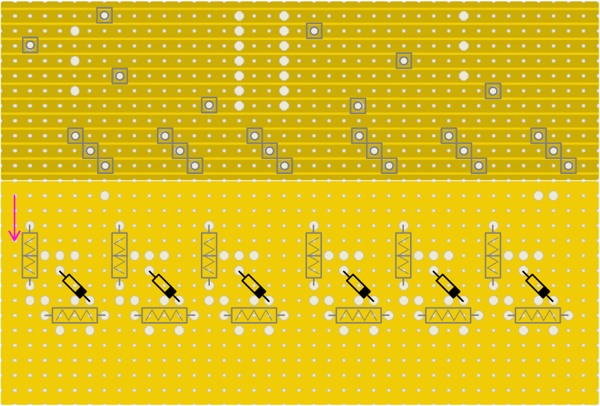

### 1.7 - Step 7: soldering Mosfet onto PCB 1 

|Pos in BOM|Part|Quantity||Tools|
|---|---|---|---|---|
|N/A|PCB 1|1|      |soldering iron with solder|
|1|<a href="https://www.reichelt.de/de/de/shop/produkt/mosfet_n-ch_55v_47a_110w_to-220ab-129819">mosfet (Infineon - IRLZ44NPBF)</a>|6| |small side-cutting pliers|

- mount the mosfet (BOM Pos 1) on PCB 1 as shown below.
    - the copper side faces downward.
    - the pink arrow indicates the direction of the copper stripes.
    - make sure that the mosfet faces the same direction as shown.
- solder them in place using a soldering iron
- shorten the wire of the mosfet using small side-cutting pliers

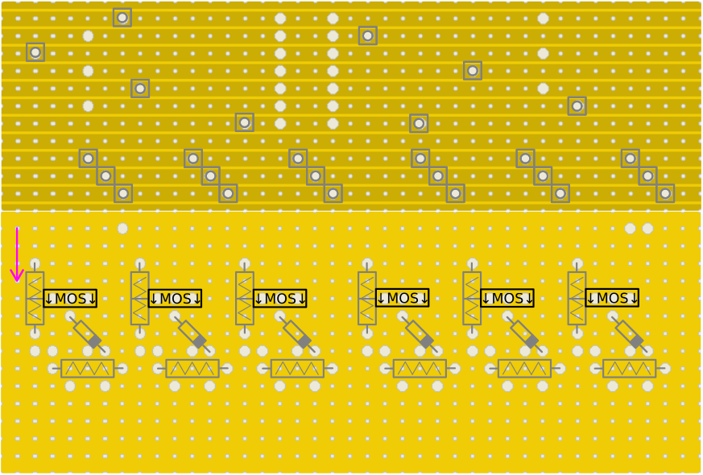

### 1.8 - Step 8: Pre-assembly of transistor

|Pos in BOM|Part|Quantity||Tools|
|---|---|---|---|---|
|2|<td><a href="https://www.reichelt.de/de/de/shop/produkt/hf-bipolartransistor_npn_100v_6a_65w_to-220-217329">transistor (MOSPEC - TIP41C)</a>|6| |small needle-nose pliers|

- To manufacture the main PCB, bend the right legs of the transistors (Pos 2) outward as shown in the figure below.

- Bend the leg to the right directly below the edge (A), where the leg becomes thicker.
- Approximately 3–5 mm further down (B), bend the leg to the left again.
- The leg does not need to fit into the PCB's hole grid on the first attempt.
- Adjust the distance between the legs by pulling the end of the leg (C) down or pushing it up.

- Ensure all legs are parallel to each other in the end.
- Leave one row on the PCB free between the right and middle legs.

### 1.9 - Step 9: soldering modified transistor onto PCB 1 

|Pos in BOM|Part|Quantity||Tools|
|---|---|---|---|---|
|N/A|PCB 1|1|      |soldering iron with solder|
|2|<td><a href="https://www.reichelt.de/de/de/shop/produkt/hf-bipolartransistor_npn_100v_6a_65w_to-220-217329">transistor (MOSPEC - TIP41C)</a>|6| |small side-cutting pliers|

- mount the transistor (BOM Pos 2) on PCB 1 as shown below.
    - the copper side faces downward.
    - the pink arrow indicates the direction of the copper stripes.
    - make sure that the transistor faces the same direction as shown.
- solder them in place using a soldering iron
- shorten the wires of the transistor using small side-cutting pliers

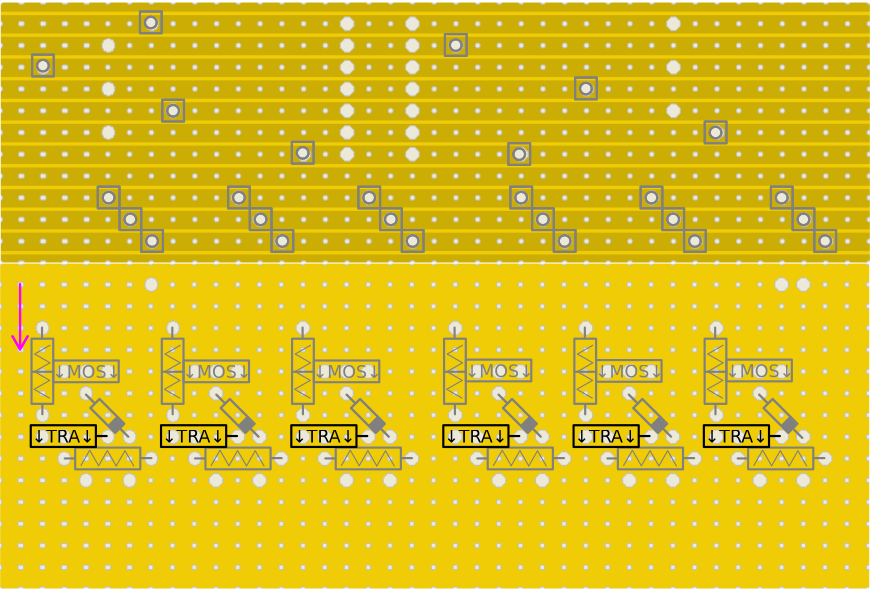

### 1.10 - Step 10: soldering Hex-Schmitt-Trigger-Inverter

|Pos in BOM|Part|Quantity||Tools|
|---|---|---|---|---|
|N/A|PCB 2|1|      |soldering iron with solder|
|9|<a href="https://www.reichelt.de/de/de/shop/produkt/ic-sockel_14-polig_doppelter_federkontakt-8206">IC-Socket (DIL-14)|1| ||
|8|<a href="https://www.reichelt.de/de/de/shop/produkt/hex-schmitt-trigger-inverter_2_6_v_dil-14-290494">Hex-Schmitt-Trigger-Inverter (Texas Instruments - 74HC 14 TI)|1| ||

- Solder the IC-Socket (DIL-14) (BOM Pos 9) on top of PCB 2 as shown below.
    - the copper side of PCB 1 faces downward.
    - the pink arrow indicates the direction of the copper stripes of PCB 1.
- Place the Hex-Schmitt-Trigger-Inverter (Texas Instruments - 74HC 14 TI) (BOM Pos 8) into the soldered IC-Socket (DIL-14) (BOM Pos 9).
    - the notch must face in the same direction as shown below.

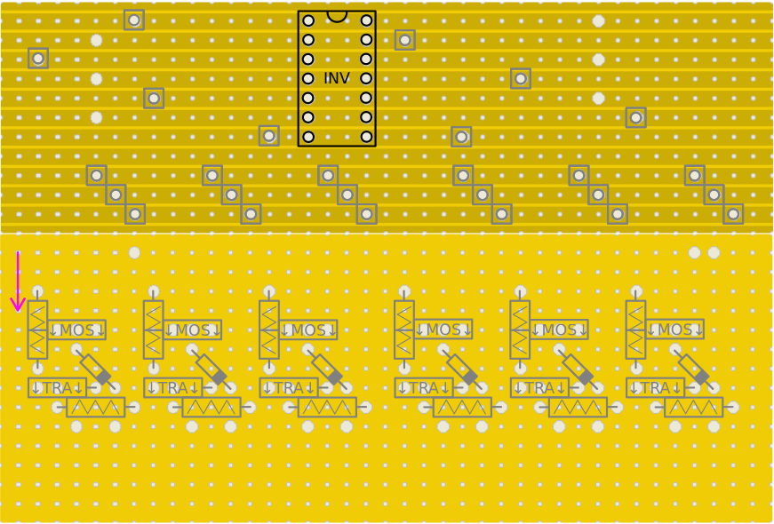

- The final assembly of the 74HC14 TI chip and DIL-14 socket must match the image below.

### 1.11 - Step 11: separating copper strips 

|Pos in BOM|Part|Quantity||Tools|
|---|---|---|---|---|
|N/A|PCB 2|1|      |sharp knife|

- separate the copper strips on PCB 2 using a sharp knife as shown below. 
    - the red lines indicate, where the copper lines have to be separated. 
    - the copper side faces downward.
    - the pink arrow indicates the direction of the copper stripes.

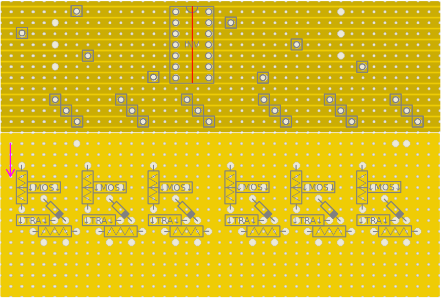

### 1.12 - Step 12: soldering cables

|Pos in BOM|Part|Quantity||Tools|
|---|---|---|---|---|
|N/A|PCB 1|1|      |soldering iron with solder|
|15.1|<a href="https://www.reichelt.de/de/de/shop/produkt/kupferlitze_isoliert_10_m_4_x_0_50_mm_sw_gn_rt_bl-280308">red insulated copper stranded wire (≥ 0,5 mm²; ca. 10 cm each)|2| ||
|15.2|<a href="https://www.reichelt.de/de/de/shop/produkt/kupferlitze_isoliert_10_m_4_x_0_50_mm_sw_gn_rt_bl-280308">black insulated copper stranded wire (≥ 0,5 mm²; ca. 10 cm each)|1| ||
|15.3|<a href="https://www.reichelt.de/de/de/shop/produkt/kupferlitze_isoliert_10_m_4_x_0_50_mm_sw_gn_rt_bl-280308">green insulated copper stranded wire (≥ 0,5 mm²; ca. 10 cm each)|6| ||
|15.4|<a href="https://www.reichelt.de/de/de/shop/produkt/kupferlitze_isoliert_10_m_4_x_0_50_mm_sw_gn_rt_bl-280308">blue insulated copper stranded wire (≥ 0,5 mm²; ca. 10 cm each)|6| ||

- Solder the insulated copper stranded wire (≥ 0,5 mm²; ca. 10 cm each) (BOM Pos 15.1 – 15.4) to PCB 1 as shown below.
    - the copper side of PCB 1 faces downward.
    - the pink arrow indicates the direction of the copper stripes of PCB 1.
    - the wire colour should match the one shown below.

|image|meaning|
|---|---|
||wire exits PCB 1 on the side of PCB 1s copper strips|
||wire exits PCB 1 on the side with no copper strips|

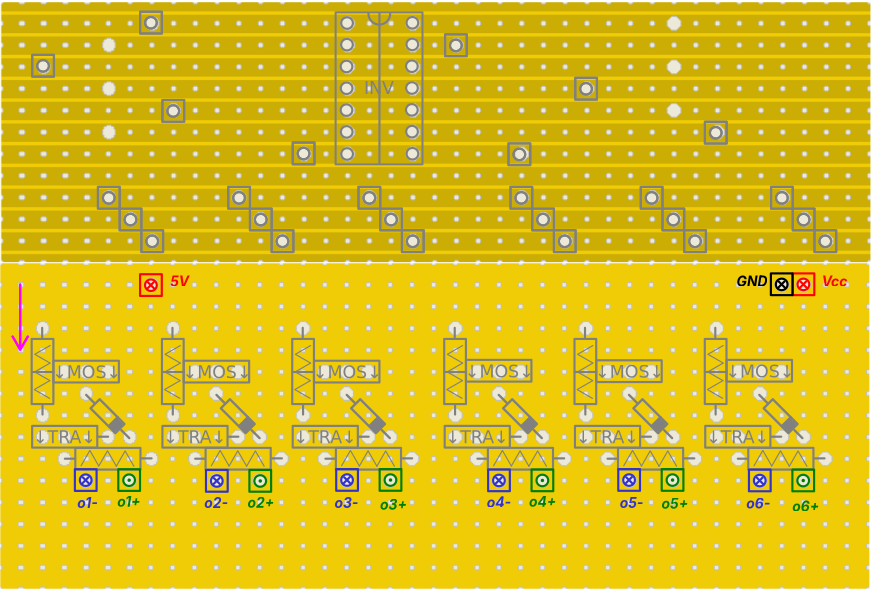

### 1.13 - Step 13: soldering cables

|Pos in BOM|Part|Quantity||Tools|
|---|---|---|---|---|
|N/A|PCB 2|1|      |soldering iron with solder|
|15.3|<a href="https://www.reichelt.de/de/de/shop/produkt/kupferlitze_isoliert_10_m_4_x_0_50_mm_sw_gn_rt_bl-280308">green insulated copper stranded wire (≥ 0,5 mm²; ca. 10 cm each)|6| ||

- Solder the green insulated copper stranded wire (≥ 0,5 mm²; ca. 10 cm each) (BOM Pos 15.3) to PCB 2 as shown below.
    - the copper side of PCB 1 faces downward.
    - the pink arrow indicates the direction of the copper stripes of PCB 1.
    - the wire colour should match the one shown below.

|image|meaning|
|---|---|
||wire exits PCB 1 on the side of PCB 1s copper strips|
||wire exits PCB 1 on the side with no copper strips|

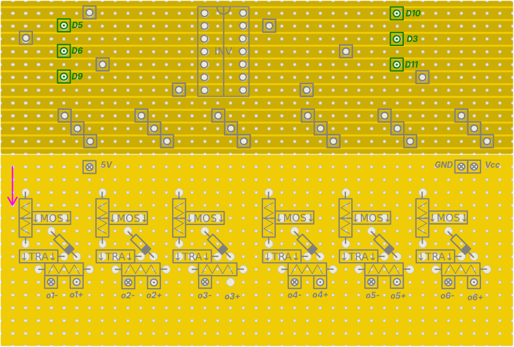

 ## 2 - 24 V Terminal Assembly

### Materials

<table>
  <tr>
    <td rowspan="1">Pos</td>
    <td rowspan="1">Part</td>
    <td colspan="6">number of parts</td>
  </tr>
  <tr>
    <td rowspan="1">11</td>
    <td rowspan="1"><a href="https://www.reichelt.de/de/de/shop/produkt/federkraftklemme_4-pol_0_08_-_1_mm_rm_5_0-72189">Spring-loaded terminal (4-pole)</td>
    <td colspan="6">1</td>
  </tr>
  <tr>
    <td rowspan="1">13</td>
    <td rowspan="1"><a href="https://www.reichelt.de/de/de/shop/produkt/lochrasterplatine_doppelseitig_80_x_20_mm-319114">perforated circuit board (80 x 20 mm)</td>
    <td colspan="6">1</td>
  </tr>
  <tr>
    <td rowspan="1">15.5</td>
    <td rowspan="1"><a href="https://www.reichelt.de/de/de/shop/produkt/kupferlitze_isoliert_10_m_4_x_0_50_mm_sw_gn_rt_bl-280308">red insulated copper stranded wire (≥ 0,5 mm²; ca. 20 cm each)</td>
    <td colspan="6">1</td>
  </tr>
  <tr>
    <td rowspan="1">15.6</td>
    <td rowspan="1"><a href="https://www.reichelt.de/de/de/shop/produkt/kupferlitze_isoliert_10_m_4_x_0_50_mm_sw_gn_rt_bl-280308">red insulated copper stranded wire (≥ 0,5 mm²; ca. 5 cm each)</td>
    <td colspan="6">1</td>
  </tr>
  <tr>
    <td rowspan="1">15.7</td>
    <td rowspan="1"><a href="https://www.reichelt.de/de/de/shop/produkt/kupferlitze_isoliert_10_m_4_x_0_50_mm_sw_gn_rt_bl-280308">black insulated copper stranded wire (≥ 0,5 mm²; ca. 20 cm each)</td>
    <td colspan="6">1</td>
  </tr>
  <tr>
    <td rowspan="1">15.8</td>
    <td rowspan="1"><a href="https://www.reichelt.de/de/de/shop/produkt/kupferlitze_isoliert_10_m_4_x_0_50_mm_sw_gn_rt_bl-280308">black insulated copper stranded wire (≥ 0,5 mm²; ca. 5 cm each)</td>
    <td colspan="6">1</td>
  </tr>
  </tr>
</table>

### Tools

- soldering iron with solder
- metal saw
- vise (recommended)
- small side-cutting pliers
- small metal file

### 2.1 - Step 1: Pre-assembling Spring-loaded terminal (4-pole)

|Pos in BOM|Part|Quantity||Tools|
|---|---|---|---|---|
|11|<a href="https://www.reichelt.de/de/de/shop/produkt/federkraftklemme_4-pol_0_08_-_1_mm_rm_5_0-72189">Spring-loaded terminal (4-pole)|1| |small metal file|
| | | | |vise (recommended)|

- The terminal pins are too large for the PCB holes.
- Carefully file down the edges of the pins until they fit into the holes of the perforated circuit board (80 x 20 mm) (BOM Pos 13).

### 2.2 - Step 2: cutting PCB to size

|Pos in BOM|Part|Quantity||Tools|
|---|---|---|---|---|
|13|<a href="https://www.reichelt.de/de/de/shop/produkt/lochrasterplatine_doppelseitig_80_x_20_mm-319114">perforated circuit board (80 x 20 mm)|1|      |metal saw|
| | | | |vise (recommended)|

- Take one perforated circuit board (80 x 20 mm) (BOM Pos 13)
- cut it to size using a metal saw.
    - measurements are written down below.
    - dont use much force at the end of the cut. Otherwise the Strip-Grid PCB will break.
      

This PCB will form now on be referenced as 24 V Terminal PCB.

### 2.3 - Step 3: soldering Spring-loaded terminal (4-pole)

|Pos in BOM|Part|Quantity||Tools|
|---|---|---|---|---|
|N/A|24 V Terminal PCB|1|      |soldering iron with solder|
|11|<a href="https://www.reichelt.de/de/de/shop/produkt/federkraftklemme_4-pol_0_08_-_1_mm_rm_5_0-72189">Spring-loaded terminal (4-pole)|1| ||

- Solder the 4-pole spring-loaded terminal (Pos 11) on the 24 V Terminal PCB as shown in the image below. 
  - Orange circles indicate the terminal pins.
  - The 4-pole spring-loaded terminal (Pos 11) is mounted on the side of the 24 V Terminal PCB facing towards you.
  - Arrows denote the direction of the spring loaded terminal ports.
      - The spring loaded terminal ports face down.

  

### 2.4 - Step 4: soldering insulated copper stranded wire to 24 V Terminal PCB

|Pos in BOM|Part|Quantity||Tools|
|---|---|---|---|---|
|N/A|24 V Terminal PCB|1|      |soldering iron with solder|
|15.5|<a href="https://www.reichelt.de/de/de/shop/produkt/kupferlitze_isoliert_10_m_4_x_0_50_mm_sw_gn_rt_bl-280308">red insulated copper stranded wire (≥ 0,5 mm²; ca. 20 cm each)|1| ||
|15.6|<a href="https://www.reichelt.de/de/de/shop/produkt/kupferlitze_isoliert_10_m_4_x_0_50_mm_sw_gn_rt_bl-280308">red insulated copper stranded wire (≥ 0,5 mm²; ca. 5 cm each)|1| ||
|15.7|<a href="https://www.reichelt.de/de/de/shop/produkt/kupferlitze_isoliert_10_m_4_x_0_50_mm_sw_gn_rt_bl-280308">black insulated copper stranded wire (≥ 0,5 mm²; ca. 20 cm each)|1| ||
|15.8|<a href="https://www.reichelt.de/de/de/shop/produkt/kupferlitze_isoliert_10_m_4_x_0_50_mm_sw_gn_rt_bl-280308">black insulated copper stranded wire (≥ 0,5 mm²; ca. 5 cm each)|1| ||

- Connect both 24 V pins with one red insulated copper stranded wire (≥ 0,5 mm²; ca. 5 cm each) (BOM Pos 15.6).
- Connect both GND pins with one black insulated copper stranded wire (≥ 0,5 mm²; ca. 5 cm each) (BOM Pos 15.8).
- Ensure no connection exists between any 24 V pin and any GND pin.
- Connect one red insulated copper stranded wire (≥ 0,5 mm²; ca. 20 cm each) (BOM Pos 15.5) to one 24 V pin.
- Connect one black insulated copper stranded wire (≥ 0,5 mm²; ca. 20 cm each) (BOM Pos 15.7) to one GND pin.
- Refer to the image below for clarity.

## 3 - Output Terminal Assembly

### Materials

<table>
  <tr>
    <td rowspan="1">Pos</td>
    <td rowspan="1">Part</td>
    <td colspan="6">number of parts</td>
  </tr>
  <tr>
    <td rowspan="1">10</td>
    <td rowspan="1"><a href="https://www.reichelt.de/de/de/shop/produkt/federkraftklemme_6-pol_0_08_-_1_mm_rm_5_0-72191">Spring-loaded terminal (6-pole)</td>
    <td colspan="6">2</td>
  </tr>
  <tr>
    <td rowspan="1">13</td>
    <td rowspan="1"><a href="https://www.reichelt.de/de/de/shop/produkt/lochrasterplatine_doppelseitig_80_x_20_mm-319114">perforated circuit board (80 x 20 mm)</td>
    <td colspan="6">1</td>
  </tr>
  <tr>
    <td rowspan="1">15.8</td>
    <td rowspan="1"><a href="https://www.reichelt.de/de/de/shop/produkt/kupferlitze_isoliert_10_m_4_x_0_50_mm_sw_gn_rt_bl-280308">black insulated copper stranded wire (≥ 0,5 mm²; ca. 5 cm each)</td>
    <td colspan="6">2</td>
  </tr>
  </tr>
</table>

### Tools

- soldering iron with solder
- metal saw
- vise (recommended)
- small side-cutting pliers
- small metal file

### 3.1 - Step 1: Pre-assembling Spring-loaded terminal (6-pole)

|Pos in BOM|Part|Quantity||Tools|
|---|---|---|---|---|
|10|<a href="https://www.reichelt.de/de/de/shop/produkt/federkraftklemme_6-pol_0_08_-_1_mm_rm_5_0-72191">Spring-loaded terminal (6-pole)|1| |small metal file|
| | | | |vise (recommended)|

- The terminal pins are too large for the PCB holes.
- Carefully file down the edges of the pins until they fit into the holes of the perforated circuit board (80 x 20 mm) (BOM Pos 13).

### 3.2 - Step 2: soldering Spring-loaded terminal (6-pole)

|Pos in BOM|Part|Quantity||Tools|
|---|---|---|---|---|
|13|<a href="https://www.reichelt.de/de/de/shop/produkt/lochrasterplatine_doppelseitig_80_x_20_mm-319114">perforated circuit board (80 x 20 mm)|1|      |soldering iron with solder|
|10|<a href="https://www.reichelt.de/de/de/shop/produkt/federkraftklemme_6-pol_0_08_-_1_mm_rm_5_0-72191">Spring-loaded terminal (6-pole)|2| ||

- Solder the 6-pole spring-loaded terminal (Pos 10) on the perforated circuit board (80 x 20 mm) (BOM Pos 13) as shown in the image below. 
  - Orange circles indicate the terminal pins.
  - The 6-pole spring-loaded terminal (Pos 10) is mounted on the side of the perforated circuit board (80 x 20 mm) (BOM Pos 13) facing towards you.
  - Arrows denote the direction of the spring loaded terminal ports.
      - The spring loaded terminal ports face down.
  - leave a 2 mm gap between the 6-pole spring-loaded terminal (Pos 10) and the perforated circuit board (80 x 20 mm) (BOM Pos 13).
      - place the perforated circuit board (80 x 20 mm) (BOM Pos 13) in the case (0 - 3D-printing) and push the 6-pole spring-loaded terminal (Pos 10) in, until it touches the case.

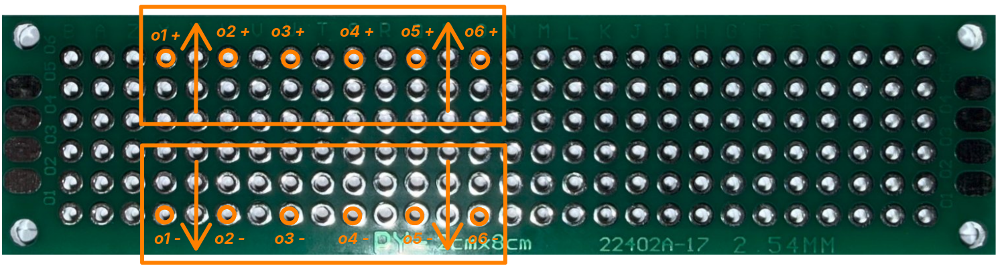  

### 3.3 - Step 3: soldering GND wires

|Pos in BOM|Part|Quantity||Tools|
|---|---|---|---|---|
|N/A|Output Terminal PCB|1|      |soldering iron with solder|
|15.8|<a href="https://www.reichelt.de/de/de/shop/produkt/kupferlitze_isoliert_10_m_4_x_0_50_mm_sw_gn_rt_bl-280308">black insulated copper stranded wire (≥ 0,5 mm²; ca. 5 cm each)|2| ||

- Connect all three GND pins with two black insulated copper stranded wires (≥ 0,5 mm²; ca. 5 cm each) (BOM Pos 15.8).
- Ensure no connection exists between any GND pin and any other pin.

## 4 - Flashing the Arduino

### Materials

<table>
  <tr>
    <td rowspan="1">Pos</td>
    <td rowspan="1">Part</td>
    <td colspan="6">number of parts</td>
  </tr>
  <tr>
    <td rowspan="1">N/A</td>
    <td rowspan="1">Arduino Nano R4</td>
    <td colspan="6">1</td>
  </tr>
  <tr>
    <td rowspan="1">N/A</td>
    <td rowspan="1">USB-C cable</td>
    <td colspan="6">1</td>
  </tr>
</table>

### Tools / Software

- PC or laptop with internet access
- [Arduino IDE](https://www.arduino.cc/en/software) (version 2.x recommended)

### 4.1 - Step 1: install the Arduino IDE

- Download the Arduino IDE from the [official website](https://www.arduino.cc/en/software) and install it.
- Launch the Arduino IDE after installation.

### 4.3 - Step 3: load the sketch

- Open the Arduino IDE.
- Open the [sketch](../firmware/do-6x-PWM.ino) and copy its content into the IDE, replacing the default code that is already present.

### 4.4 - Step 4: select board and port

- Connect the Arduino to the PC using the USB cable.
- In the Arduino IDE, go to **Tools → Board** and select the Arduino model being used (Arduino Nano R4).
- Go to **Tools → Port** and select the COM port (Windows) or the device (macOS/Linux) the Arduino is connected to.
    - If no port is shown, check the USB cable connection and driver installation.

### 4.5 - Step 5: upload the sketch

- Click the **Upload** button (arrow icon) in the Arduino IDE.
- Wait until the sketch has been compiled and transferred to the Arduino.
    - The message "Upload complete" appears at the bottom of the console.
- Some drivers or libraries may be missing. In this case, the IDE will notify you with a popup — install them, then click **Upload** again.
- If errors still occur:
    - Check that the correct board and port are selected (step 4.4).
    - Check that all required libraries are installed (step 4.3).

### 4.6 - Step 6: verify functionality

- Open the **Serial Monitor** (**Tools → Serial Monitor**) to check the Arduino's output.
    - Set the baud rate to 9600.
    - Type `serveID` (case sensitive!) and note down the output on the Arduino case.
        - It should look like this: `do-6x-PWM_123`. The numbers after the underscore are random.

## 5 setting DCDC converter voltage

### Materials 

<table>
  <tr>
    <td rowspan="1">Pos</td>
    <td rowspan="1">Part</td>
    <td colspan="6">number of parts</td>
  </tr>
  <tr>
    <td rowspan="1">7</td>
    <td rowspan="1"><a href="https://www.reichelt.com/de/en/shop/product/developer_boards_-_voltage_regulators_dc_dc_converters-333853#closemodal">DCDC converter (SBC-BUCK01)</td>
    <td colspan="6">1</td>
  </tr>
  </tr>
</table>

### Tools

- small flathead screwdriver.

  
### Steps

- Plug the DCDC converter (SBC-BUCK01) (BOM Pos 7) into the 24V power supply.
- Verify the Display shows 24 V.
- Press the button (S1) in the lower right corner.
- Use a small flathead screwdriver to turn the brass screw on top of the blue Voltage Adjustment box.
- Adjust until the display shows 10 V.
 
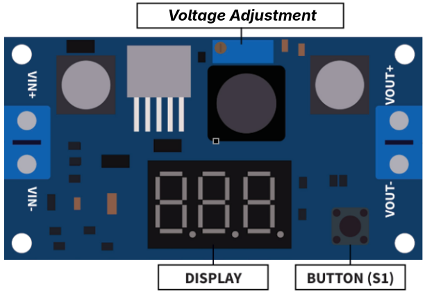  

## 6 connecting all components

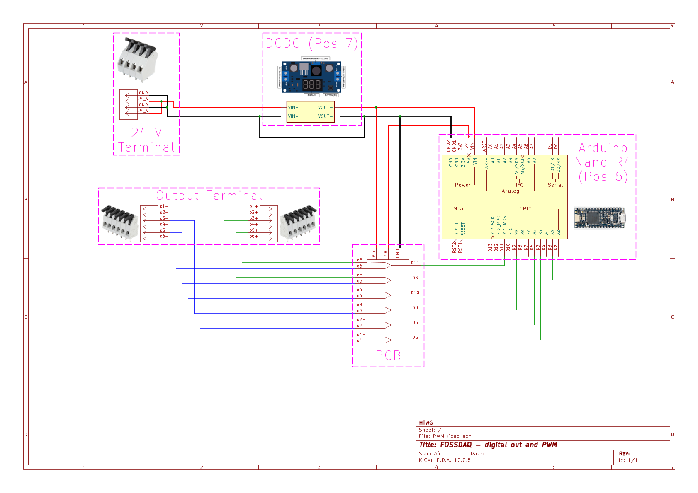

- Connect all assembled components as shown in the drawing above.
- Keep wires as short as possible to ensure they fit into the case.

## Description of used symbols
|Pos|symbol|description|
|---|---|---|
|1||mosfet; arrows pointing in the direction of the writing on the mosfet (infineon - IRLZ 44N)|
|2||transistor; arrows pointing in the direction of the writing on the transistor (MOSPEC - TIP41C)|
|3||diode (Taiwan Semiconductor Company - 1N5819)|
|4||electrical resistor (10 kOhm)|
|12||single pin from pin header (16x1; 2,54 mm)|
|15||wire exiting underneath the PCB (approximately 20 cm)|
|15||wire exiting on top of the PCB (approximately 20 cm)|
||red lines| cut the copper strips with a sharp knife|
||large white dots|soldering points|
||small white dots|open PCB holes|
