# do-PWM-1to6x

## 0 3D printing case
- Start printing the case and all additional 3D components.

## 1 cutting PCBs to size
- **IMPORTANT:**
  Ensure the copper side of PCBs face down.
  Align the copper lines with the direction of the blue arrow in the upper left corner.
  The copper lines of PCB 1 must always face down unless specified otherwise.

### 1.1 PCB 1
1. Take one Strip-Grid PCB (Pos 5).
2. Cut it to the required size using a metal saw.
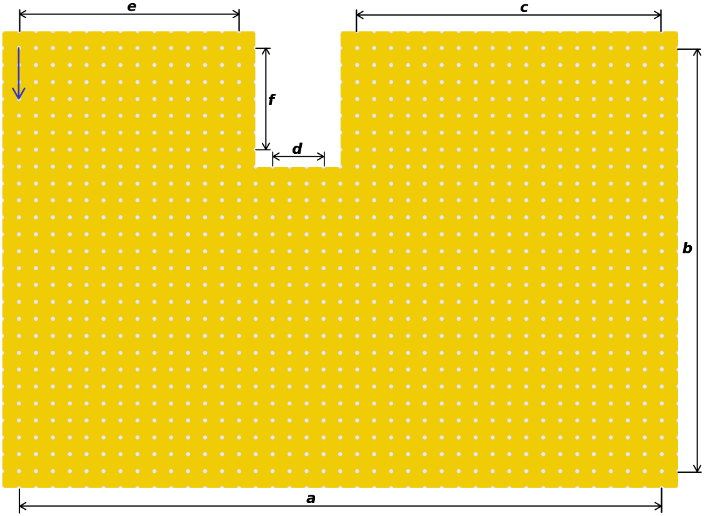
The measurements are:
|index|measurement|
|---|---|
|a|39 holes|
|b|26 holes|
|c|19 holes|
|d|4 holes|
|e|14 holes|
|f|7 holes|

### 1.2 PCB 2

- Take one Strip-Grid PCB (Pos 5).
- Cut it to the required size using a metal saw.

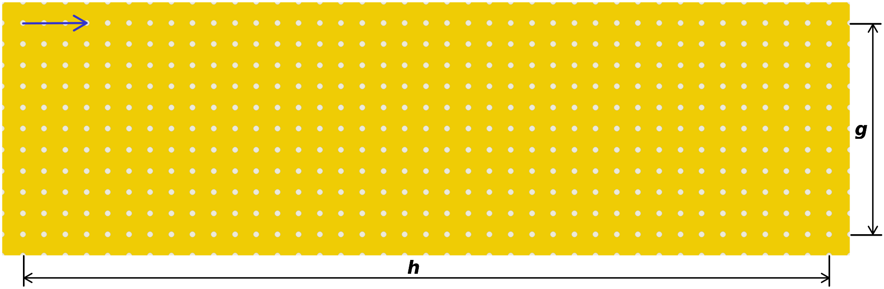
The measurements are:
|index|measurement|
|---|---|
|g|11 holes|
|h|39 holes|

### 1.3 PCB 24 V Terminal

- Take one perforated circuit board (2.54 mm; 80 x 20 mm) (Pos 13).
- Cut it to the required size using a metal saw.

## Description of used symbols
|Pos|symbol|description|
|---|---|---|
|1||mosfet; arrows pointing in the direction of the writing on the mosfet (infineon - IRLZ 44N)|
|2|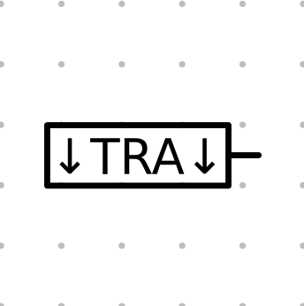|transistor; arrows pointing in the direction of the writing on the transistor (STMicroelectronics - TIP41C)|
|3||diode (Taiwan Semiconductor Company - 1N5819)|
|4|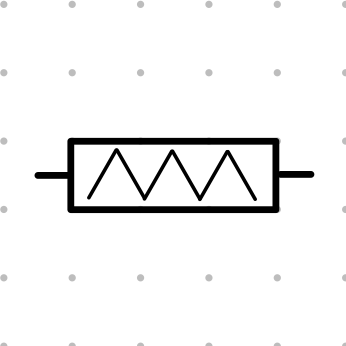|electrical resistor (10 kOhm)|
|12||single pin from pin header (16x1; 2,54 mm)|
|15||wire exiting underneath the PCB (approximately 20 cm)|
|15||wire exiting on top of the PCB (approximately 20 cm)|
||red lines| cut the copper strips with a sharp knife|
||large white dots|soldering points|
||small white dots|open PCB holes|

## 2 Pre-assembly of transistor

- To manufacture the main PCB, bend the right legs of the transistors (Pos 2) outward as shown in the figure below.

- Bend the leg to the right directly below the edge (A), where the leg becomes thicker.
- Approximately 3–5 mm further down (B), bend the leg to the left again.
- The leg does not need to fit into the PCB's hole grid on the first attempt.
- Adjust the distance between the legs by pulling the end of the leg (C) down or pushing it up.

- Ensure all legs are parallel to each other in the end.
- Leave one row on the PCB free between the right and middle legs.

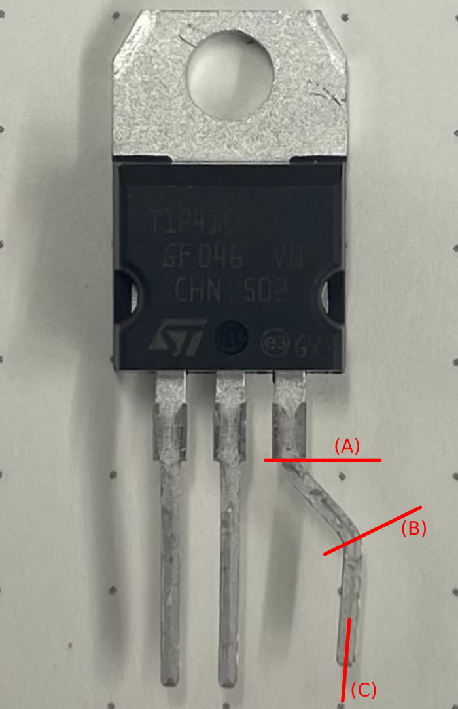

## 3 PCB assembly
- **IMPORTANT:**
  Ensure the copper side of **PCB 1** faces down.
  Align the copper lines with the direction of the blue arrow in the upper left corner.
  The copper lines of PCB 1 must always face down unless specified otherwise.

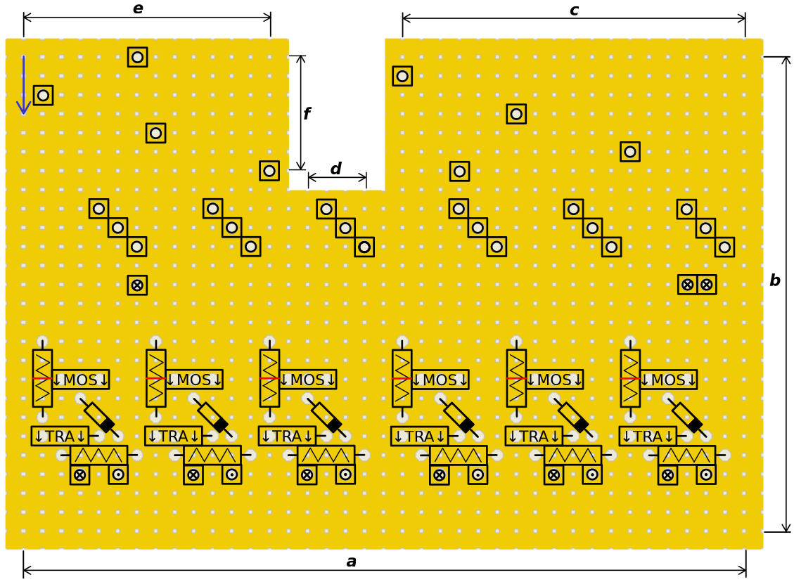

- If fewer than six outputs are required, use the following alternatives:
  - Greyed-out sections are for reference only.
  - Do not assemble greyed-out sections.
  - [5x](../images/PCB_5x.png)
  - [4x](../images/PCB_4x.png)
  - [3x](../images/PCB_3x.png)
  - [2x](../images/PCB_2x.png)
  - [1x](../images/PCB_1x.png)

- Insert all jumper pins (Pos 12) first. Do not solder them yet.
- Align PCB 2 on top of PCB 1 as shown.
  - PCB 2 must cover the cutout in PCB 1 completely.
  - PCB 2 and PCB 1 must be flush on three edges.
  - PCB 2 must not overhang any edges of PCB 1.
- Ensure all jumper pins pass through both PCBs.
- Fully solder two jumper pins (Pos 12) to mechanically connect the two PCBs and prevent the remaining jumper pins from falling out.

- Fully solder the remaining jumper pins (Pos 12).
- Solder the remaining parts (Pos 1, 2, 3 and 4) as shown in the layout.

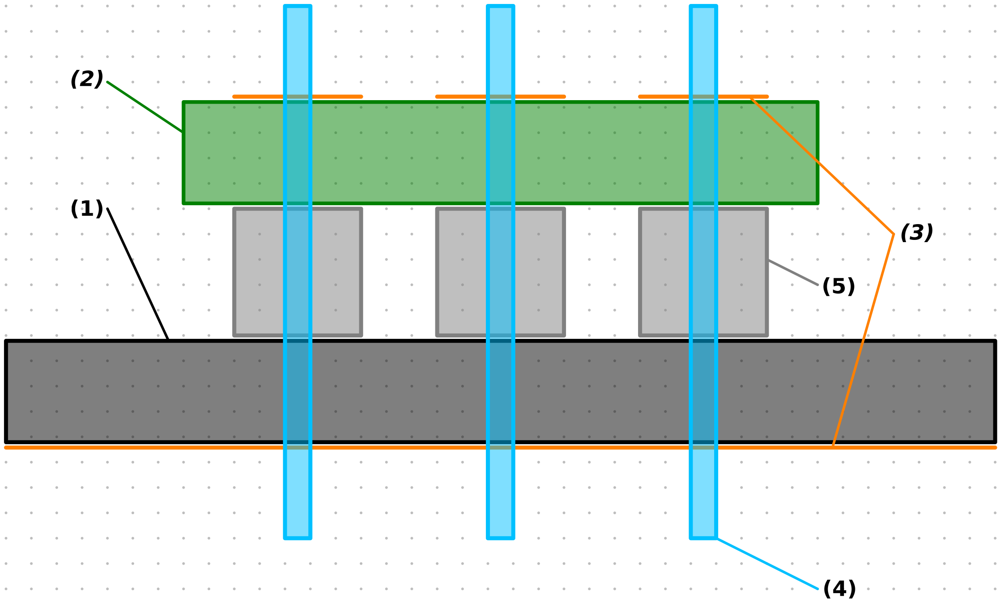

|1||PCB 1|
|2|PCB2|
|3|copper lines|
|4|metal part of jumper pins|
|5|plastic part of jumper pins|

- **IMPORTANT:**
  Flip the PCB to the opposite side from its current position.

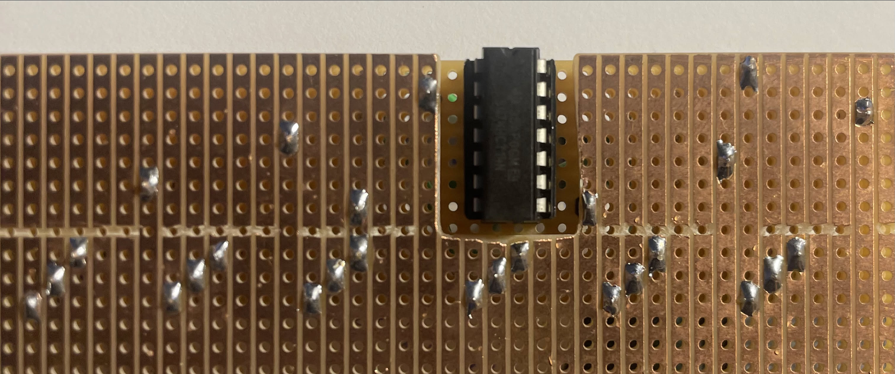

- Solder the DIL-14 (Pos 9) socket as shown in the image above.
- Insert the 74HCT14TI (Pos 8) chip into the socket with the notch facing upward.

- **IMPORTANT:**
  Flip the PCB to the opposite side from its current position.

  
- After assembling all components (Pos 1, 2, 3, 4, 5, 8 and 9) as described and connecting both PCBs, the setup should match the reference, excluding six green wires (Pos 15) and cut copper traces. Add these now.

- All wires are described in the image below.
- Option 1: Tag each wire with a small sticky note for identification.
- Option 2: Refer back to the image later to identify their connections.

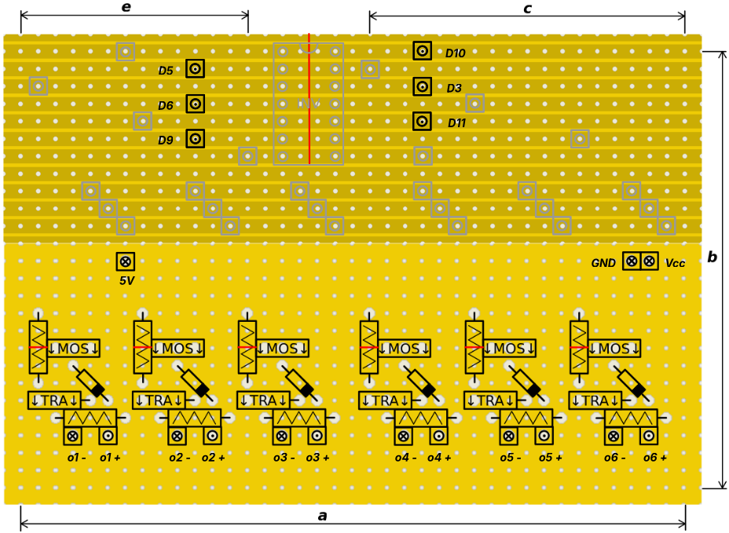  

## 4 Terminals

### 4.1 Pre-assembling the Terminals

- The terminal pins are too large for the PCB holes.
- Carefully file down the edges of the pins slightly.

### 4.2 Assembly 24 V terminal

  

- Place the 4-pole spring-loaded terminal (Pos 11) on the previously cut PCB as shown in the image above.
  - Orange circles indicate the terminal pins.
  - Arrows denote the direction of the terminal ports.

- Connect both 24 V pins with short red wires.
- Connect both GND pins with short black wires.
- Ensure no connection exists between any 24 V pin and any GND pin.
- Add one pair of long wires (approximately 20 cm) for one pair of pins.
  - Use red for 24 V.
  - Use black for GND.
- Refer to the image below for clarity.

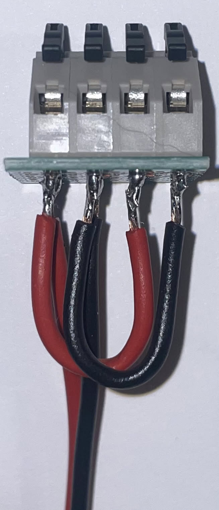

### 4.3 Assembly Output terminal

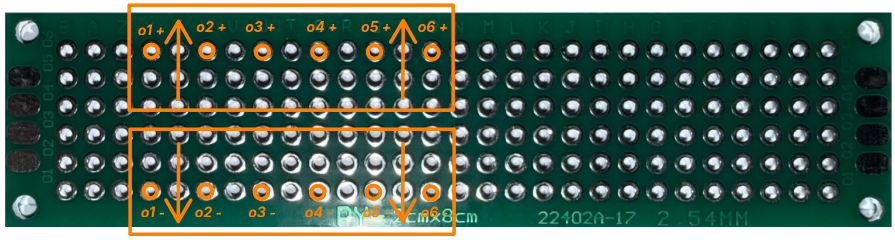  

- Place the 6-pole spring-loaded terminal (Pos 10) on the previously cut PCB as shown in the image above.
  - Orange circles indicate the terminal pins.
  - Arrows denote the direction of the terminal ports.
- Solder the placed terminals.

## connecting all components

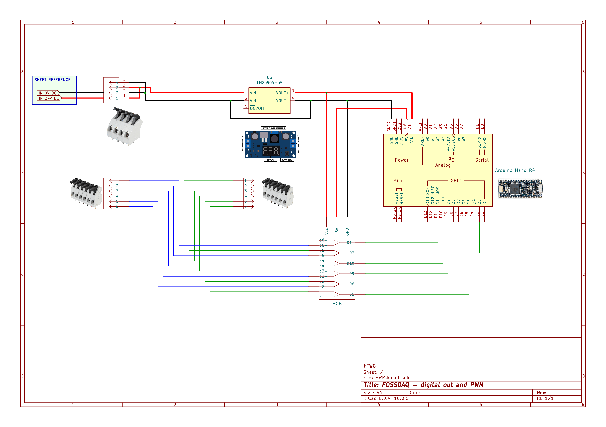

- Connect all assembled components as shown in the drawing above.
- Keep wires as short as possible to ensure they fit into the case.
